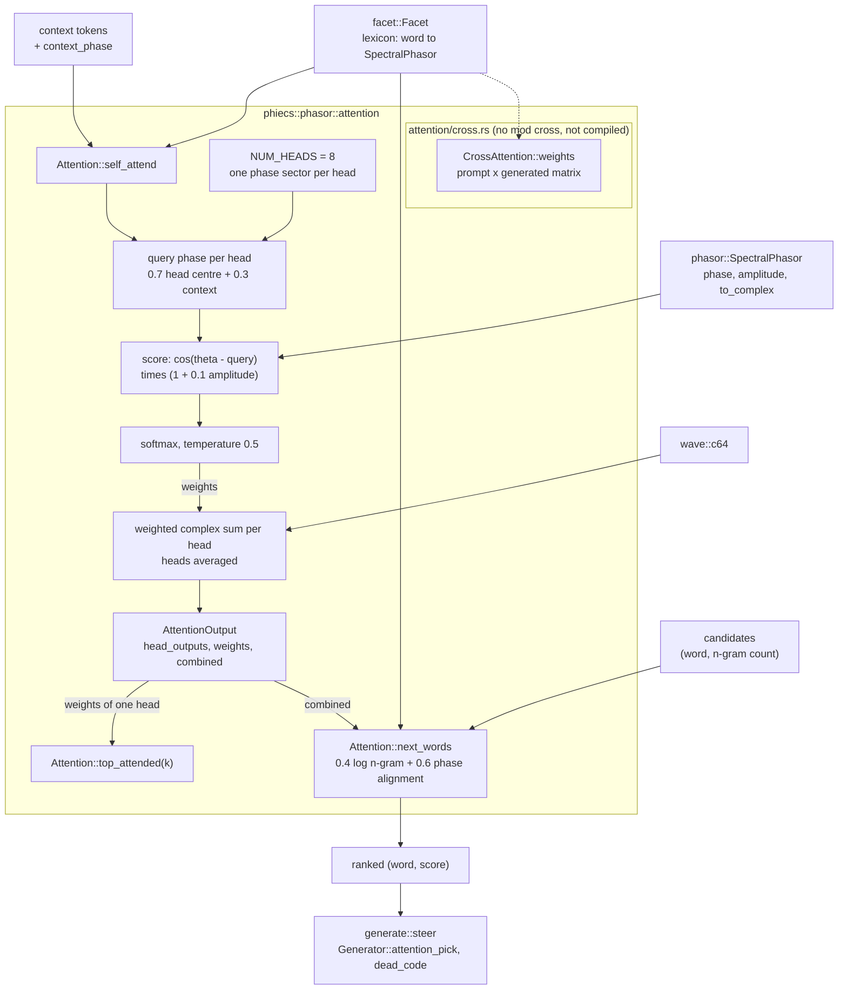

# phasor · attention

`phiecs::phasor::attention` — it was phiano's `attention`.

```mermaid
graph TB
    Facet["facet::Facet<br/>lexicon: word to SpectralPhasor"]
    SP["phasor::SpectralPhasor<br/>phase, amplitude, to_complex"]
    C64["wave::c64"]
    Context["context tokens<br/>+ context_phase"]
    Cands["candidates<br/>(word, n-gram count)"]

    subgraph attention["phiecs::phasor::attention"]
        Heads["NUM_HEADS = 8<br/>one phase sector per head"]
        SelfAttend["Attention::self_attend"]
        Query["query phase per head<br/>0.7 head centre + 0.3 context"]
        Score["score: cos(theta - query)<br/>times (1 + 0.1 amplitude)"]
        Softmax["softmax, temperature 0.5"]
        Sum["weighted complex sum per head<br/>heads averaged"]
        Output["AttentionOutput<br/>head_outputs, weights, combined"]
        TopK["Attention::top_attended(k)"]
        Next["Attention::next_words<br/>0.4 log n-gram + 0.6 phase alignment"]
        subgraph crossrs["attention/cross.rs (no mod cross, not compiled)"]
            Cross["CrossAttention::weights<br/>prompt x generated matrix"]
        end
    end

    Steer["generate::steer<br/>Generator::attention_pick, dead_code"]
    Ranked["ranked (word, score)"]

    Context --> SelfAttend
    Facet --> SelfAttend
    Heads --> Query
    SelfAttend --> Query
    Query --> Score
    SP --> Score
    Score --> Softmax
    Softmax -->|"weights"| Sum
    C64 --> Sum
    Sum --> Output
    Output -->|"weights of one head"| TopK
    Output -->|"combined"| Next
    Cands --> Next
    Facet --> Next
    Next --> Ranked
    Ranked --> Steer
    Facet -.-> Cross
```
