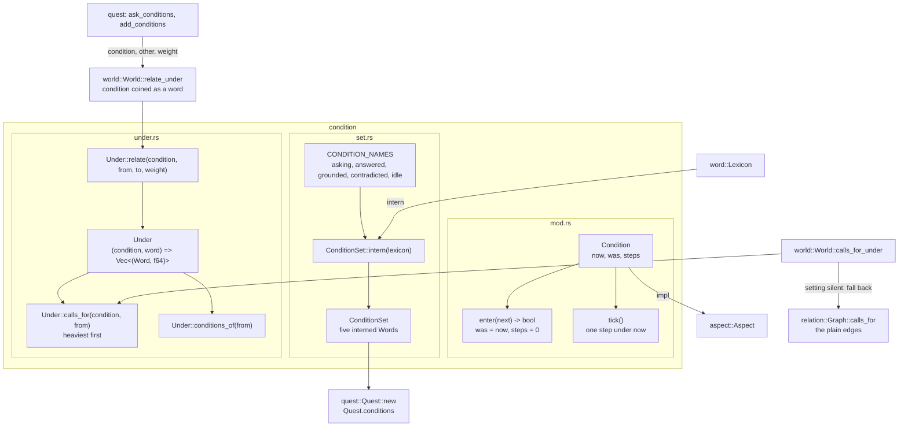

# condition

```mermaid
graph TB
    subgraph conditionMod["condition"]
        subgraph modRs["mod.rs"]
            ConditionT["Condition<br/>now, was, steps"]
            enterFn["enter(next) -&gt; bool<br/>was = now, steps = 0"]
            tickFn["tick()<br/>one step under now"]
        end
        subgraph setRs["set.rs"]
            NamesC["CONDITION_NAMES<br/>asking, answered, grounded, contradicted, idle"]
            internFn["ConditionSet::intern(lexicon)"]
            CSetT["ConditionSet<br/>five interned Words"]
        end
        subgraph underRs["under.rs"]
            UnderT["Under<br/>(condition, word) =&gt; Vec&lt;(Word, f64)&gt;"]
            relateFn["Under::relate(condition, from, to, weight)"]
            callsForFn["Under::calls_for(condition, from)<br/>heaviest first"]
            condsOfFn["Under::conditions_of(from)"]
        end
    end
    AspectT["aspect::Aspect"]
    LexiconT["word::Lexicon"]
    QuestNew["quest::Quest::new<br/>Quest.conditions"]
    QuestAsk["quest: ask_conditions, add_conditions"]
    RelateUnder["world::World::relate_under<br/>condition coined as a word"]
    CallsUnder["world::World::calls_for_under"]
    GraphCalls["relation::Graph::calls_for<br/>the plain edges"]

    ConditionT --> enterFn
    ConditionT --> tickFn
    ConditionT -->|"impl"| AspectT
    NamesC --> internFn
    LexiconT -->|"intern"| internFn
    internFn --> CSetT
    CSetT --> QuestNew
    QuestAsk -->|"condition, other, weight"| RelateUnder
    RelateUnder --> relateFn
    relateFn --> UnderT
    UnderT --> callsForFn
    UnderT --> condsOfFn
    CallsUnder --> callsForFn
    CallsUnder -->|"setting silent: fall back"| GraphCalls
```
