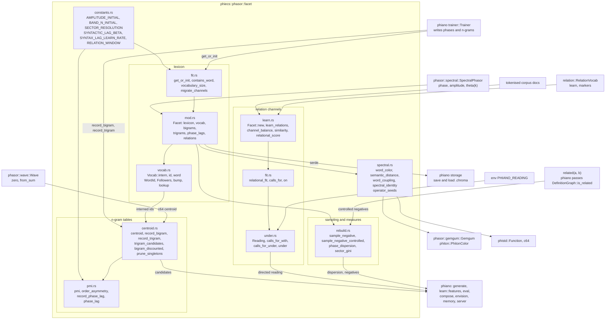

# phasor · facet

```mermaid
graph TB
    Phasor["phasor::spectral::SpectralPhasor<br/>phase, amplitude, theta(k)"]
    Relational["relation::RelationVocab<br/>learn, markers"]
    Corpus["tokenised corpus docs"]
    TrainerN["phiano trainer::Trainer<br/>writes phases and n-grams"]
    Related["related(a, b)<br/>phiano passes DefinitionGraph::is_related"]
    EnvVar["env PHIANO_READING"]
    Gemgum["phasor::gemgum::Gemgum<br/>phiton::PhitonColor"]
    Phistd["phistd::Function, c64"]
    WaveN["phasor::wave::Wave<br/>zero, from_sum"]
    Storage["phiano storage<br/>save and load .chroma"]
    Readers["phiano: generate, learn::features, eval,<br/>compose, envision, memory, server"]

    subgraph facet["phiecs::phasor::facet"]
        Consts["constants.rs<br/>AMPLITUDE_INITIAL, BAND_N_INITIAL, SECTOR_RESOLUTION<br/>SYNTACTIC_LAG_BETA, SYNTAX_LAG_LEARN_RATE, RELATION_WINDOW"]
        subgraph lexcore["lexicon"]
            FacetT["mod.rs<br/>Facet: lexicon, vocab, bigrams,<br/>trigrams, phase_lags, relations"]
            VocabT["vocab.rs<br/>Vocab::intern, id, word<br/>WordId, Followers, bump, lookup"]
            Fit["fit.rs<br/>get_or_init, contains_word,<br/>vocabulary_size, migrate_channels"]
        end
        subgraph ngramtables["n-gram tables"]
            Ngram["centroid.rs<br/>centroid, record_bigram, record_trigram,<br/>trigram_candidates, bigram_discounted, prune_singletons"]
            Pmi["pmi.rs<br/>pmi, order_asymmetry,<br/>record_phase_lag, phase_lag"]
        end
        subgraph relations["relation channels"]
            Learn["learn.rs<br/>Facet::new, learn_relations,<br/>channel_balance, similarity, relational_score"]
            FitRel["fit.rs<br/>relational_fit, calls_for, on"]
            Under["under.rs<br/>Reading, calls_for_with,<br/>calls_for_under, under"]
        end
        subgraph measures["sampling and measures"]
            Rebuild["rebuild.rs<br/>sample_negative, sample_negative_controlled,<br/>phase_dispersion, sector_gini"]
        end
        Spectral["spectral.rs<br/>word_color, semantic_distance,<br/>word_coupling, spectral_identity<br/>operator_seeds"]
    end

    Phasor --> FacetT
    FacetT --> VocabT
    Consts --> Fit
    Consts --> Pmi
    TrainerN -->|"get_or_init"| Fit
    Fit --> FacetT
    TrainerN -->|"record_bigram, record_trigram"| Ngram
    VocabT -->|"interned ids"| Ngram
    Ngram --> Pmi
    WaveN -->|"c64 centroid"| Ngram
    Corpus --> Learn
    Relational --> Learn
    Learn --> FitRel
    FitRel --> Under
    EnvVar --> Under
    FacetT --> Rebuild
    Related -->|"controlled negatives"| Rebuild
    FacetT --> Spectral
    Spectral --> Gemgum
    Spectral --> Phistd
    FacetT -->|"serde"| Storage
    Ngram -->|"candidates"| Readers
    Under -->|"directed reading"| Readers
    Rebuild -->|"dispersion, negatives"| Readers
```
