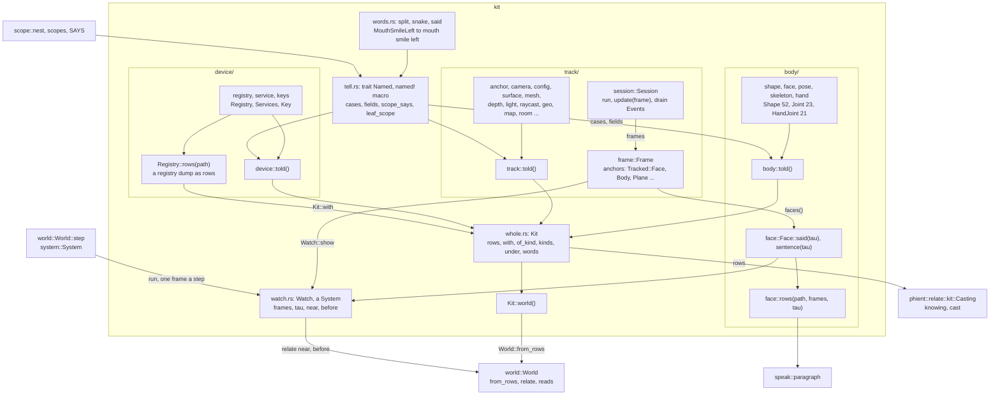

# kit

```mermaid
graph TB
    ScopeIn["scope::nest, scopes, SAYS"]
    subgraph kitMod["kit"]
        wordsRs["words.rs: split, snake, said<br/>MouthSmileLeft to mouth smile left"]
        tellRs["tell.rs: trait Named, named! macro<br/>cases, fields, scope_says, leaf_scope"]
        subgraph bodyDir["body/"]
            bodyParts["shape, face, pose, skeleton, hand<br/>Shape 52, Joint 23, HandJoint 21"]
            faceSaid["face::Face::said(tau), sentence(tau)"]
            faceRows["face::rows(path, frames, tau)"]
            bodyTold["body::told()"]
        end
        subgraph trackDir["track/"]
            trackParts["anchor, camera, config, surface, mesh,<br/>depth, light, raycast, geo, map, room ..."]
            sessionT["session::Session<br/>run, update(frame), drain Events"]
            frameT["frame::Frame<br/>anchors: Tracked::Face, Body, Plane ..."]
            trackTold["track::told()"]
        end
        subgraph deviceDir["device/"]
            deviceParts["registry, service, keys<br/>Registry, Services, Key"]
            registryRows["Registry::rows(path)<br/>a registry dump as rows"]
            deviceTold["device::told()"]
        end
        wholeRs["whole.rs: Kit<br/>rows, with, of_kind, kinds, under, words"]
        kitWorld["Kit::world()"]
        watchRs["watch.rs: Watch, a System<br/>frames, tau, near, before"]
    end
    SpeakIn["speak::paragraph"]
    WorldOut["world::World<br/>from_rows, relate, reads"]
    StepIn["world::World::step<br/>system::System"]
    CastingOut["phient::relate::kit::Casting<br/>knowing, cast"]

    wordsRs --> tellRs
    ScopeIn --> tellRs
    bodyParts --> bodyTold
    trackParts --> trackTold
    deviceParts --> deviceTold
    tellRs -->|"cases, fields"| bodyTold
    tellRs --> trackTold
    tellRs --> deviceTold
    bodyTold --> wholeRs
    trackTold --> wholeRs
    deviceTold --> wholeRs
    deviceParts --> registryRows
    registryRows -->|"Kit::with"| wholeRs
    wholeRs --> kitWorld
    kitWorld -->|"World::from_rows"| WorldOut
    wholeRs -->|"rows"| CastingOut
    sessionT -->|"frames"| frameT
    frameT -->|"faces()"| faceSaid
    faceSaid --> faceRows
    faceRows --> SpeakIn
    frameT -->|"Watch::show"| watchRs
    faceSaid --> watchRs
    StepIn -->|"run, one frame a step"| watchRs
    watchRs -->|"relate near, before"| WorldOut
```
