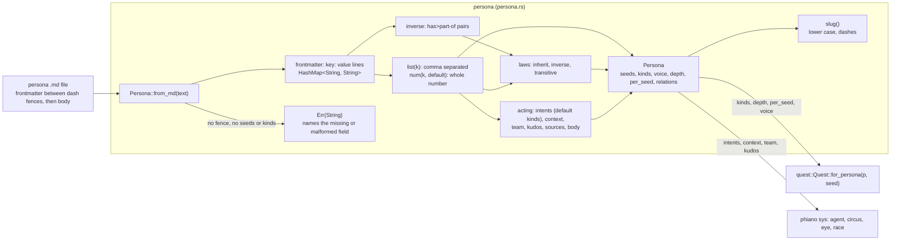

# persona

```mermaid
graph LR
    MdFile["persona .md file<br/>frontmatter between dash fences, then body"]
    subgraph personaMod["persona (persona.rs)"]
        fromMd["Persona::from_md(text)"]
        frontMap["frontmatter: key: value lines<br/>HashMap&lt;String, String&gt;"]
        listNum["list(k): comma separated<br/>num(k, default): whole number"]
        inversePairs["inverse: has&gt;part-of pairs"]
        PersonaT["Persona<br/>seeds, kinds, voice, depth, per_seed, relations"]
        lawsF["laws: inherit, inverse, transitive"]
        actF["acting: intents (default kinds), context,<br/>team, kudos, sources, body"]
        errS["Err(String)<br/>names the missing or malformed field"]
        slugFn["slug()<br/>lower case, dashes"]
    end
    ForPersona["quest::Quest::for_persona(p, seed)"]
    PhianoSys["phiano sys: agent, circus, eye, race"]

    MdFile --> fromMd
    fromMd --> frontMap
    frontMap --> listNum
    listNum --> PersonaT
    frontMap --> inversePairs
    inversePairs --> lawsF
    listNum --> lawsF
    listNum --> actF
    lawsF --> PersonaT
    actF --> PersonaT
    fromMd -->|"no fence, no seeds or kinds"| errS
    PersonaT --> slugFn
    PersonaT -->|"kinds, depth, per_seed, voice"| ForPersona
    PersonaT -->|"intents, context, team, kudos"| PhianoSys
```
