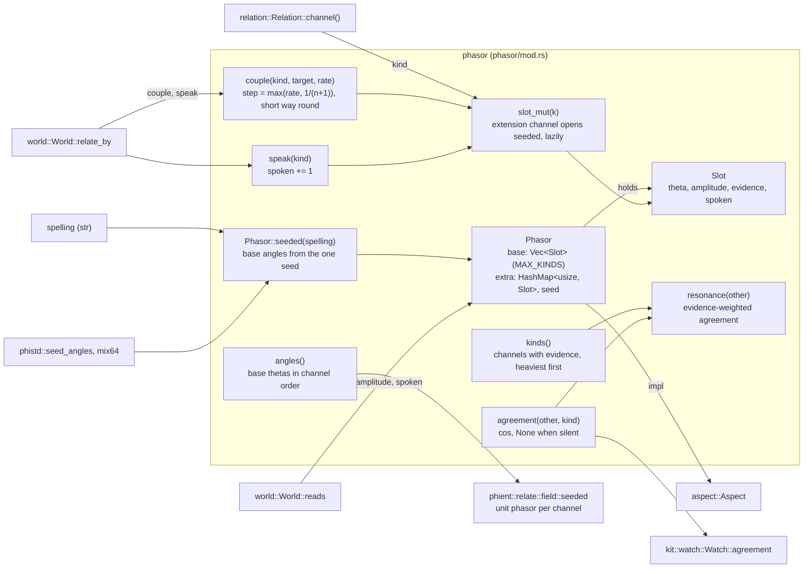
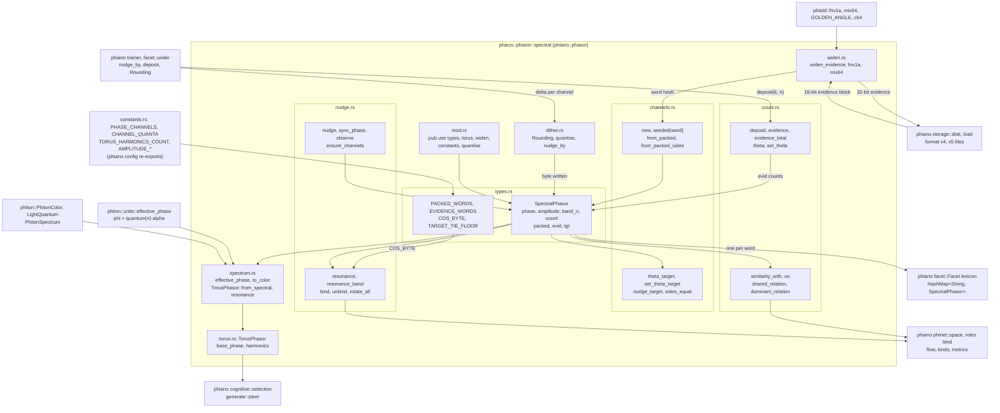
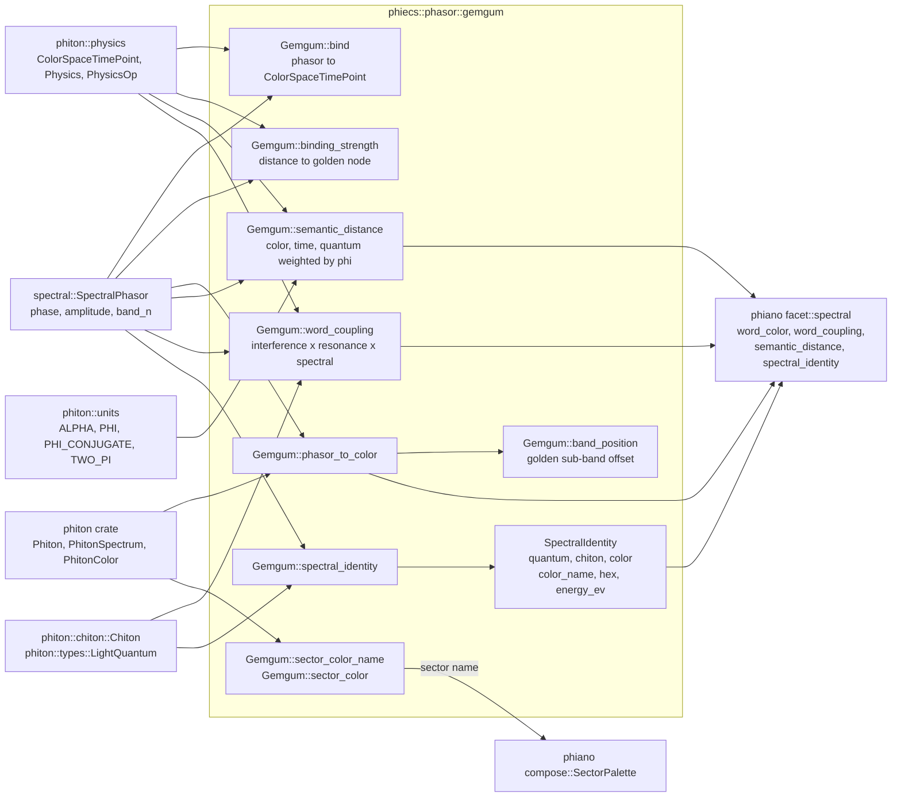

# phasor

```mermaid
graph LR
    SpellingIn["spelling (str)"]
    PhistdSeed["phistd::seed_angles, mix64"]
    RelationK["relation::Relation::channel()"]
    subgraph phasorMod["phasor (phasor/mod.rs)"]
        seededFn["Phasor::seeded(spelling)<br/>base angles from the one seed"]
        PhasorT["Phasor<br/>base: Vec&lt;Slot&gt; (MAX_KINDS)<br/>extra: HashMap&lt;usize, Slot&gt;, seed"]
        SlotT["Slot<br/>theta, amplitude, evidence, spoken"]
        slotMut["slot_mut(k)<br/>extension channel opens seeded, lazily"]
        coupleFn["couple(kind, target, rate)<br/>step = max(rate, 1/(n+1)), short way round"]
        speakFn["speak(kind)<br/>spoken += 1"]
        agreementFn["agreement(other, kind)<br/>cos, None when silent"]
        resonanceFn["resonance(other)<br/>evidence-weighted agreement"]
        kindsFn["kinds()<br/>channels with evidence, heaviest first"]
        anglesFn["angles()<br/>base thetas in channel order"]
    end
    AspectT["aspect::Aspect"]
    RelateBy["world::World::relate_by"]
    WorldReads["world::World::reads"]
    WatchAgree["kit::watch::Watch::agreement"]
    FieldSeeded["phient::relate::field::seeded<br/>unit phasor per channel"]

    SpellingIn --> seededFn
    PhistdSeed --> seededFn
    seededFn --> PhasorT
    PhasorT -->|"holds"| SlotT
    PhasorT -->|"impl"| AspectT
    RelationK -->|"kind"| slotMut
    coupleFn --> slotMut
    speakFn --> slotMut
    slotMut --> SlotT
    kindsFn --> resonanceFn
    agreementFn --> resonanceFn
    RelateBy -->|"couple, speak"| coupleFn
    RelateBy --> speakFn
    WorldReads -->|"theta, amplitude, spoken"| PhasorT
    agreementFn --> WatchAgree
    anglesFn --> FieldSeeded
```

## spectral: the word packed for a lexicon

```mermaid
graph TB
    Config["constants.rs: PHASE_CHANNELS, CHANNEL_QUANTA<br/>TORUS_HARMONICS_COUNT, AMPLITUDE_*<br/>(phiano config re-exports)"]
    Phistd["phistd::fnv1a, mix64, GOLDEN_ANGLE, c64"]
    Physics["phiton::units::effective_phase<br/>phi + quantum(n) alpha"]
    Phiton["phiton::PhitonColor, LightQuantum<br/>PhitonSpectrum"]
    Trainer["phiano trainer, facet::under<br/>nudge_by, deposit, Rounding"]
    Storage["phiano storage::disk, load<br/>format v4, v5 files"]
    Facet["phiano facet::Facet lexicon<br/>HashMap&lt;String, SpectralPhasor&gt;"]
    Readers["phiano phinet::space, roles bind<br/>flow, kinds, metrics"]
    Torus["phiano cognitive::selection<br/>generate::steer"]

    subgraph spectral["phiecs::phasor::spectral (phiano::phasor)"]
        Root["mod.rs<br/>pub use types, torus, widen,<br/>constants, quantise"]
        subgraph typesrs["types.rs"]
            SP["SpectralPhasor<br/>phase, amplitude, band_n, count<br/>packed, evid, tgt"]
            Consts["PACKED_WORDS, EVIDENCE_WORDS<br/>COS_BYTE, TARGET_TIE_FLOOR"]
        end
        subgraph channelsrs["channels.rs"]
            Ctor["new, seeded(word)<br/>from_packed, from_packed_sides"]
            Target["theta_target, set_theta_target<br/>nudge_target, sides_equal"]
        end
        subgraph countrs["count.rs"]
            Deposit["deposit, evidence, evidence_total<br/>theta, set_theta"]
            Sim["similarity_with, on<br/>shared_relation, dominant_relation"]
        end
        subgraph nudgers["nudge.rs"]
            Nudge["nudge, sync_phase, observe<br/>ensure_channels"]
            Reson["resonance, resonance_band<br/>bind, unbind, rotate_all"]
        end
        Dither["dither.rs<br/>Rounding, quantise, nudge_by"]
        Spectrum["spectrum.rs<br/>effective_phase, to_color<br/>TorusPhasor::from_spectral, resonance"]
        TorusRs["torus.rs: TorusPhasor<br/>base_phase, harmonics"]
        Widen["widen.rs<br/>widen_evidence, fnv1a, mix64"]
    end

    Config --> Consts
    Phistd --> Widen
    Widen -->|"word hash"| Ctor
    Ctor --> SP
    SP --> Target
    Trainer -->|"delta per channel"| Dither
    Dither -->|"byte written"| SP
    Nudge --> SP
    Trainer -->|"deposit(k, n)"| Deposit
    Deposit -->|"evid counts"| SP
    SP --> Sim
    Consts -->|"COS_BYTE"| Reson
    SP --> Reson
    SP --> Spectrum
    Physics --> Spectrum
    Phiton --> Spectrum
    Spectrum --> TorusRs
    Storage -->|"16-bit evidence block"| Widen
    Widen -->|"32-bit evidence"| Storage
    Root --> SP
    SP -->|"one per word"| Facet
    Sim --> Readers
    Reson --> Readers
    TorusRs --> Torus
```

## gemgum: the spectral phasor read as light

```mermaid
graph LR
    Phasor["spectral::SpectralPhasor<br/>phase, amplitude, band_n"]
    Physics["phiton::physics<br/>ColorSpaceTimePoint, Physics, PhysicsOp"]
    Phiton["phiton crate<br/>Phiton, PhitonSpectrum, PhitonColor"]
    Chiton["phiton::chiton::Chiton<br/>phiton::types::LightQuantum"]
    Config["phiton::units<br/>ALPHA, PHI, PHI_CONJUGATE, TWO_PI"]
    Palette["phiano compose::SectorPalette"]
    FacetSpec["phiano facet::spectral<br/>word_color, word_coupling,<br/>semantic_distance, spectral_identity"]

    subgraph gemgum["phiecs::phasor::gemgum"]
        Bind["Gemgum::bind<br/>phasor to ColorSpaceTimePoint"]
        Strength["Gemgum::binding_strength<br/>distance to golden node"]
        ToColor["Gemgum::phasor_to_color"]
        SectorColor["Gemgum::sector_color_name<br/>Gemgum::sector_color"]
        Distance["Gemgum::semantic_distance<br/>color, time, quantum weighted by phi"]
        BandPos["Gemgum::band_position<br/>golden sub-band offset"]
        Coupling["Gemgum::word_coupling<br/>interference x resonance x spectral"]
        IdentFn["Gemgum::spectral_identity"]
        Identity["SpectralIdentity<br/>quantum, chiton, color<br/>color_name, hex, energy_ev"]
    end

    Phasor --> Bind
    Phasor --> Strength
    Phasor --> ToColor
    Phasor --> Distance
    Phasor --> Coupling
    Phasor --> IdentFn
    Physics --> Bind
    Physics --> Strength
    Physics --> Distance
    Physics --> Coupling
    Config --> Distance
    Phiton --> ToColor
    Phiton --> SectorColor
    Chiton --> Coupling
    Chiton --> IdentFn
    ToColor --> BandPos
    IdentFn --> Identity
    SectorColor -->|"sector name"| Palette
    ToColor --> FacetSpec
    Distance --> FacetSpec
    Coupling --> FacetSpec
    Identity --> FacetSpec
```
