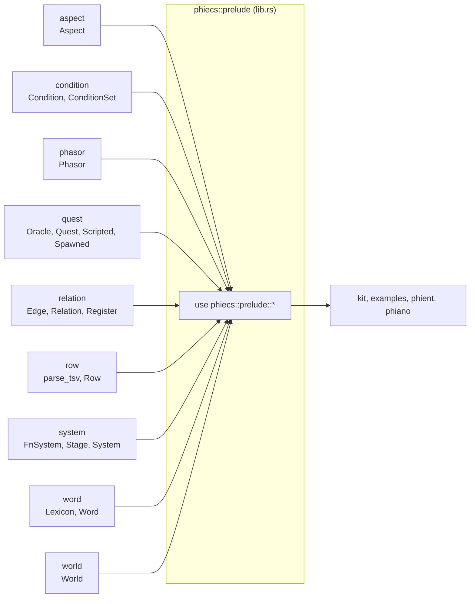

# prelude

```mermaid
graph LR
    subgraph prelude["phiecs::prelude (lib.rs)"]
        P["use phiecs::prelude::*"]
    end
    ASP["aspect<br/>Aspect"]
    CON["condition<br/>Condition, ConditionSet"]
    PHA["phasor<br/>Phasor"]
    QUE["quest<br/>Oracle, Quest, Scripted, Spawned"]
    REL["relation<br/>Edge, Relation, Register"]
    ROW["row<br/>parse_tsv, Row"]
    SYS["system<br/>FnSystem, Stage, System"]
    WOR["word<br/>Lexicon, Word"]
    WLD["world<br/>World"]
    USERS["kit, examples, phient, phiano"]
    ASP --> P
    CON --> P
    PHA --> P
    QUE --> P
    REL --> P
    ROW --> P
    SYS --> P
    WOR --> P
    WLD --> P
    P --> USERS
```
