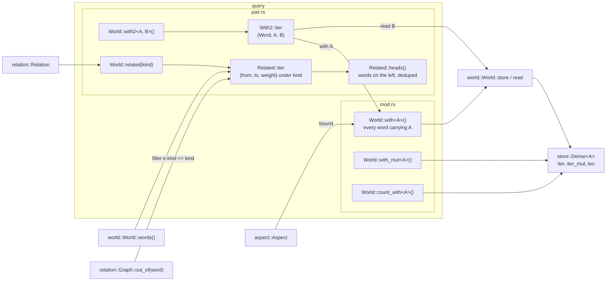

# query

```mermaid
graph LR
    AspectT["aspect::Aspect"]
    KindIn["relation::Relation"]
    subgraph queryMod["query"]
        subgraph modRs["mod.rs"]
            withFn["World::with&lt;A&gt;()<br/>every word carrying A"]
            withMutFn["World::with_mut&lt;A&gt;()"]
            countWithFn["World::count_with&lt;A&gt;()"]
        end
        subgraph pairRs["pair.rs"]
            with2Fn["World::with2&lt;A, B&gt;()"]
            With2T["With2::iter<br/>(Word, A, B)"]
            relatedFn["World::related(kind)"]
            RelatedT["Related::iter<br/>(from, to, weight) under kind"]
            headsFn["Related::heads()<br/>words on the left, deduped"]
        end
    end
    WorldStore["world::World::store / read"]
    DenseIter["store::Dense&lt;A&gt;<br/>iter, iter_mut, len"]
    WorldWords["world::World::words()"]
    GraphOut["relation::Graph::out_of(word)"]

    AspectT -->|"bound"| withFn
    withFn --> WorldStore
    WorldStore --> DenseIter
    withMutFn --> DenseIter
    countWithFn --> DenseIter
    with2Fn --> With2T
    With2T -->|"with A"| withFn
    With2T -->|"read B"| WorldStore
    KindIn --> relatedFn
    relatedFn --> RelatedT
    WorldWords --> RelatedT
    GraphOut -->|"filter e.kind == kind"| RelatedT
    RelatedT --> headsFn
```
