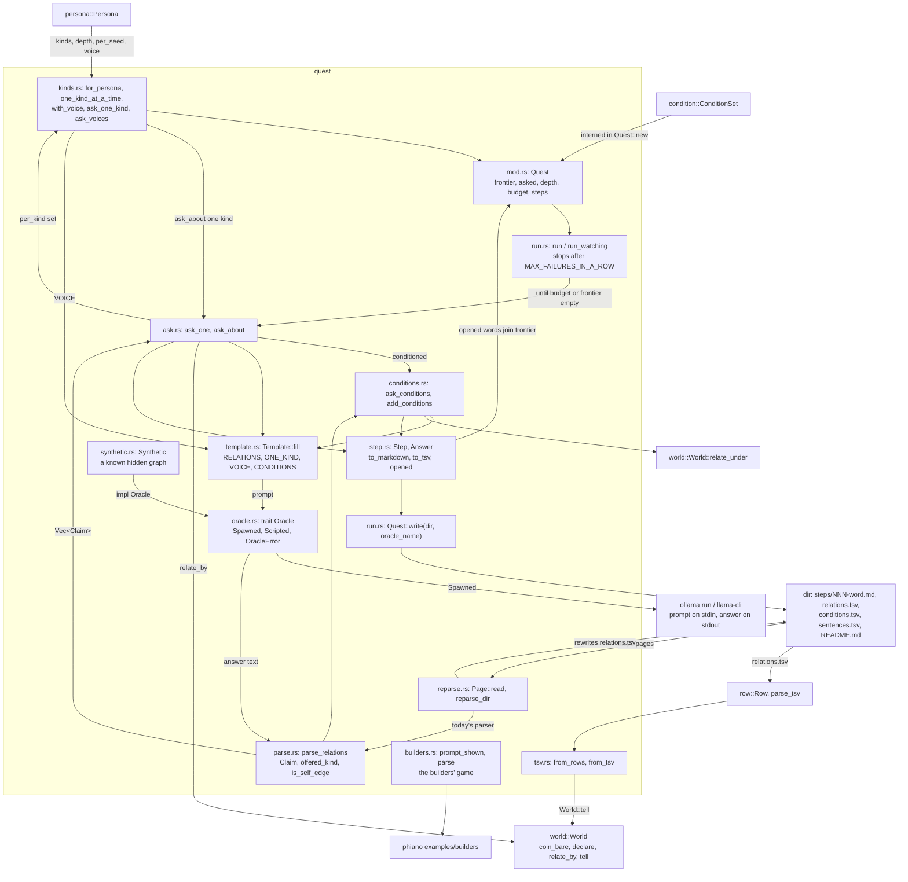

# quest

```mermaid
graph TB
    PersonaIn["persona::Persona"]
    CondSet["condition::ConditionSet"]
    subgraph questMod["quest"]
        QuestT["mod.rs: Quest<br/>frontier, asked, depth, budget, steps"]
        kindsRs["kinds.rs: for_persona, one_kind_at_a_time,<br/>with_voice, ask_one_kind, ask_voices"]
        runRs["run.rs: run / run_watching<br/>stops after MAX_FAILURES_IN_A_ROW"]
        askRs["ask.rs: ask_one, ask_about"]
        condRs["conditions.rs: ask_conditions, add_conditions"]
        templateRs["template.rs: Template::fill<br/>RELATIONS, ONE_KIND, VOICE, CONDITIONS"]
        oracleRs["oracle.rs: trait Oracle<br/>Spawned, Scripted, OracleError"]
        syntheticRs["synthetic.rs: Synthetic<br/>a known hidden graph"]
        parseRs["parse.rs: parse_relations<br/>Claim, offered_kind, is_self_edge"]
        stepRs["step.rs: Step, Answer<br/>to_markdown, to_tsv, opened"]
        writeFn["run.rs: Quest::write(dir, oracle_name)"]
        tsvRs["tsv.rs: from_rows, from_tsv"]
        reparseRs["reparse.rs: Page::read, reparse_dir"]
        buildersRs["builders.rs: prompt_shown, parse<br/>the builders' game"]
    end
    ModelCmd["ollama run / llama-cli<br/>prompt on stdin, answer on stdout"]
    WorldIn["world::World<br/>coin_bare, declare, relate_by, tell"]
    RelateUnder["world::World::relate_under"]
    DiskOut["dir: steps/NNN-word.md, relations.tsv,<br/>conditions.tsv, sentences.tsv, README.md"]
    RowIn["row::Row, parse_tsv"]
    PhianoEx["phiano examples/builders"]

    PersonaIn -->|"kinds, depth, per_seed, voice"| kindsRs
    kindsRs --> QuestT
    CondSet -->|"interned in Quest::new"| QuestT
    QuestT --> runRs
    runRs -->|"until budget or frontier empty"| askRs
    askRs -->|"per_kind set"| kindsRs
    kindsRs -->|"ask_about one kind"| askRs
    askRs -->|"conditioned"| condRs
    askRs --> templateRs
    condRs --> templateRs
    kindsRs -->|"VOICE"| templateRs
    templateRs -->|"prompt"| oracleRs
    oracleRs -->|"Spawned"| ModelCmd
    syntheticRs -->|"impl Oracle"| oracleRs
    oracleRs -->|"answer text"| parseRs
    parseRs -->|"Vec&lt;Claim&gt;"| askRs
    parseRs --> condRs
    askRs -->|"relate_by"| WorldIn
    condRs --> RelateUnder
    askRs --> stepRs
    condRs --> stepRs
    stepRs -->|"opened words join frontier"| QuestT
    stepRs --> writeFn
    writeFn --> DiskOut
    DiskOut -->|"relations.tsv"| RowIn
    RowIn --> tsvRs
    tsvRs -->|"World::tell"| WorldIn
    DiskOut -->|"steps pages"| reparseRs
    reparseRs -->|"today's parser"| parseRs
    reparseRs -->|"rewrites relations.tsv"| DiskOut
    buildersRs --> PhianoEx
```
