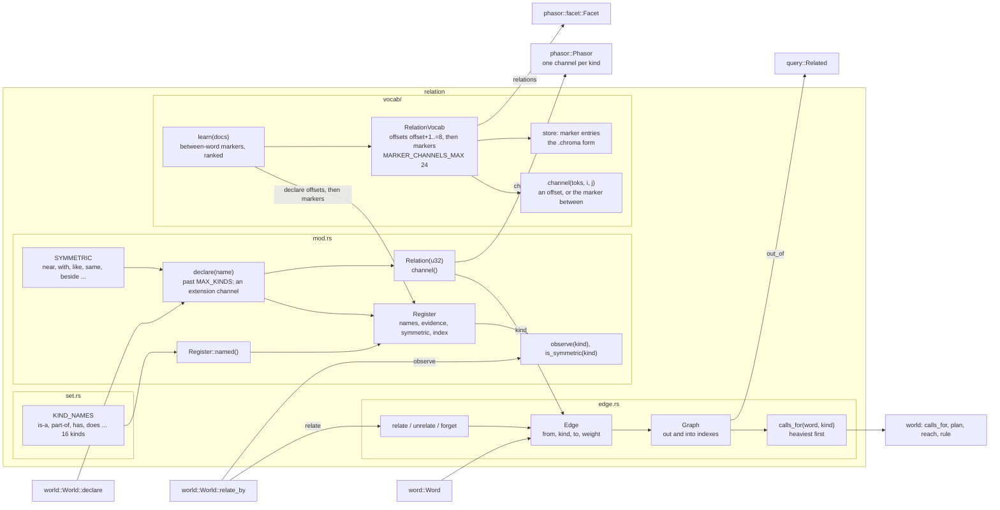

# relation

```mermaid
graph LR
    subgraph relationMod["relation"]
        subgraph setRs["set.rs"]
            KindNames["KIND_NAMES<br/>is-a, part-of, has, does ... 16 kinds"]
        end
        subgraph modRs["mod.rs"]
            namedFn["Register::named()"]
            RegisterT["Register<br/>names, evidence, symmetric, index"]
            declareFn["declare(name)<br/>past MAX_KINDS: an extension channel"]
            SymmetricC["SYMMETRIC<br/>near, with, like, same, beside ..."]
            RelationT["Relation(u32)<br/>channel()"]
            observeFn["observe(kind), is_symmetric(kind)"]
        end
        subgraph edgeRs["edge.rs"]
            EdgeT["Edge<br/>from, kind, to, weight"]
            GraphT["Graph<br/>out and into indexes"]
            graphWrite["relate / unrelate / forget"]
            callsForFn["calls_for(word, kind)<br/>heaviest first"]
        end
        subgraph vocabMod["vocab/"]
            VocabT["RelationVocab<br/>offsets offset+1..=8, then markers<br/>MARKER_CHANNELS_MAX 24"]
            learnFn["learn(docs)<br/>between-word markers, ranked"]
            channelFn["channel(toks, i, j)<br/>an offset, or the marker between"]
            storeFn["store: marker entries<br/>the .chroma form"]
        end
    end
    WorldDeclare["world::World::declare"]
    WorldRelate["world::World::relate_by"]
    WordIn["word::Word"]
    PhasorCh["phasor::Phasor<br/>one channel per kind"]
    WorldReaders["world: calls_for, plan, reach, rule"]
    RelatedQ["query::Related"]

    KindNames --> namedFn
    namedFn --> RegisterT
    WorldDeclare --> declareFn
    SymmetricC --> declareFn
    declareFn --> RegisterT
    declareFn --> RelationT
    RegisterT --> observeFn
    WorldRelate -->|"observe"| observeFn
    WorldRelate -->|"relate"| graphWrite
    WordIn --> EdgeT
    RelationT -->|"kind"| EdgeT
    graphWrite --> EdgeT
    EdgeT --> GraphT
    GraphT --> callsForFn
    RelationT -->|"channel"| PhasorCh
    callsForFn --> WorldReaders
    GraphT -->|"out_of"| RelatedQ
    learnFn -->|"declare offsets, then markers"| RegisterT
    learnFn --> VocabT
    VocabT --> channelFn
    VocabT --> storeFn
    VocabT -->|"relations"| FacetR["phasor::facet::Facet"]
```
