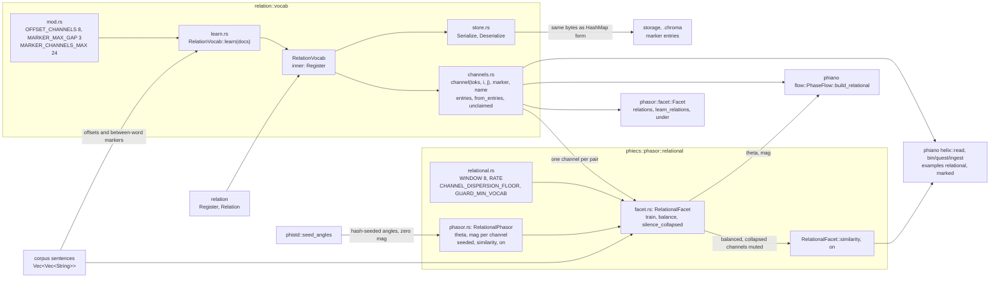

# relational

```mermaid
graph LR
    Docs["corpus sentences<br/>Vec&lt;Vec&lt;String&gt;&gt;"]
    subgraph rv["relation::vocab"]
        Consts["mod.rs<br/>OFFSET_CHANNELS 8, MARKER_MAX_GAP 3<br/>MARKER_CHANNELS_MAX 24"]
        Vocab["RelationVocab<br/>inner: Register"]
        Learn["learn.rs<br/>RelationVocab::learn(docs)"]
        VocabRs["channels.rs<br/>channel(toks, i, j), marker, name<br/>entries, from_entries, unclaimed"]
        Store["store.rs<br/>Serialize, Deserialize"]
    end
    Register["relation<br/>Register, Relation"]
    Seed["phistd::seed_angles"]
    Storage["storage, .chroma<br/>marker entries"]
    Facet["phasor::facet::Facet<br/>relations, learn_relations, under"]
    Flow["phiano flow::PhaseFlow::build_relational"]
    Users["phiano helix::read, bin/quest/ingest<br/>examples relational, marked"]

    subgraph relational["phiecs::phasor::relational"]
        Own["relational.rs<br/>WINDOW 8, RATE<br/>CHANNEL_DISPERSION_FLOOR, GUARD_MIN_VOCAB"]
        RP["phasor.rs: RelationalPhasor<br/>theta, mag per channel<br/>seeded, similarity, on"]
        RF["facet.rs: RelationalFacet<br/>train, balance, silence_collapsed"]
        Query["RelationalFacet::similarity, on"]
    end

    Docs -->|"offsets and between-word markers"| Learn
    Learn --> Vocab
    Register --> Vocab
    Consts --> Learn
    Vocab --> VocabRs
    Vocab --> Store
    Store -->|"same bytes as HashMap form"| Storage
    Seed -->|"hash-seeded angles, zero mag"| RP
    Docs --> RF
    VocabRs -->|"one channel per pair"| RF
    RP --> RF
    Own --> RF
    RF -->|"balanced, collapsed channels muted"| Query
    VocabRs --> Facet
    VocabRs --> Flow
    RF -->|"theta, mag"| Flow
    VocabRs --> Users
    Query --> Users
```
