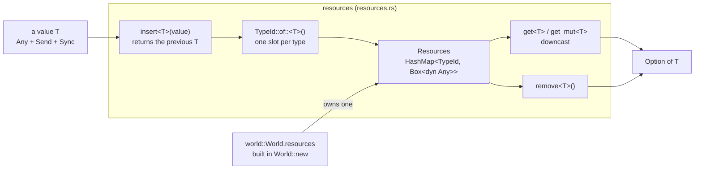

# resources

```mermaid
graph LR
    ValueIn["a value T<br/>Any + Send + Sync"]
    subgraph resourcesMod["resources (resources.rs)"]
        ResourcesT["Resources<br/>HashMap&lt;TypeId, Box&lt;dyn Any&gt;&gt;"]
        keyFn["TypeId::of::&lt;T&gt;()<br/>one slot per type"]
        insertFn["insert&lt;T&gt;(value)<br/>returns the previous T"]
        getFn["get&lt;T&gt; / get_mut&lt;T&gt;<br/>downcast"]
        removeFn["remove&lt;T&gt;()"]
    end
    WorldOwner["world::World.resources<br/>built in World::new"]
    ValueOut["Option of T"]

    ValueIn --> insertFn
    insertFn --> keyFn
    keyFn --> ResourcesT
    ResourcesT --> getFn
    ResourcesT --> removeFn
    getFn --> ValueOut
    removeFn --> ValueOut
    WorldOwner -->|"owns one"| ResourcesT
```
