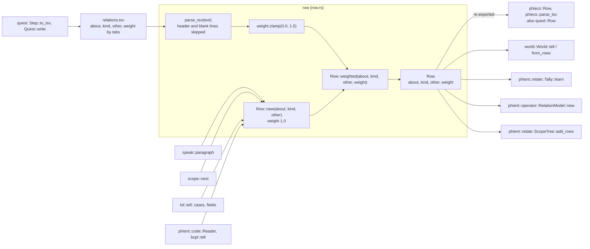

# row

```mermaid
graph LR
    QuestOut["quest: Step::to_tsv, Quest::write"]
    TsvFile["relations.tsv<br/>about, kind, other, weight by tabs"]
    SpeakIn["speak::paragraph"]
    ScopeIn["scope::nest"]
    KitIn["kit::tell: cases, fields"]
    CodeIn["phient::code::Reader, bcpl::tell"]
    subgraph rowMod["row (row.rs)"]
        parseTsv["parse_tsv(text)<br/>header and blank lines skipped"]
        clampW["weight.clamp(0.0, 1.0)"]
        newFn["Row::new(about, kind, other)<br/>weight 1.0"]
        weightedFn["Row::weighted(about, kind, other, weight)"]
        RowT["Row<br/>about, kind, other, weight"]
    end
    CrateRoot["phiecs::Row, phiecs::parse_tsv<br/>also quest::Row"]
    WorldTell["world::World::tell / from_rows"]
    TallyIn["phient::relate::Tally::learn"]
    ModelIn["phient::operator::RelationModel::new"]
    TreeIn["phient::relate::ScopeTree::add_rows"]

    QuestOut --> TsvFile
    TsvFile --> parseTsv
    parseTsv --> clampW
    clampW --> weightedFn
    SpeakIn --> newFn
    ScopeIn --> newFn
    KitIn --> newFn
    CodeIn --> newFn
    newFn --> weightedFn
    weightedFn --> RowT
    RowT -->|"re-exported"| CrateRoot
    RowT --> WorldTell
    RowT --> TallyIn
    RowT --> ModelIn
    RowT --> TreeIn
```
