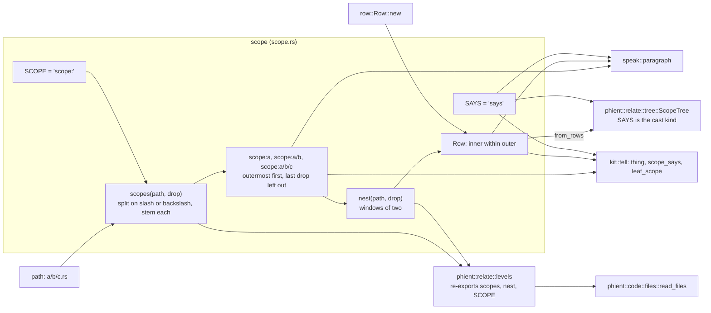

# scope

```mermaid
graph LR
    PathIn["path: a/b/c.rs"]
    subgraph scopeMod["scope (scope.rs)"]
        ScopeC["SCOPE = 'scope:'"]
        SaysC["SAYS = 'says'"]
        scopesFn["scopes(path, drop)<br/>split on slash or backslash, stem each"]
        scopeList["scope:a, scope:a/b, scope:a/b/c<br/>outermost first, last drop left out"]
        nestFn["nest(path, drop)<br/>windows of two"]
        withinRows["Row: inner within outer"]
    end
    RowT["row::Row::new"]
    SpeakOut["speak::paragraph"]
    KitTell["kit::tell: thing, scope_says, leaf_scope"]
    PhientLevels["phient::relate::levels<br/>re-exports scopes, nest, SCOPE"]
    PhientFiles["phient::code::files::read_files"]
    ScopeTreeIn["phient::relate::tree::ScopeTree<br/>SAYS is the cast kind"]

    PathIn --> scopesFn
    ScopeC --> scopesFn
    scopesFn --> scopeList
    scopeList --> nestFn
    nestFn --> withinRows
    RowT --> withinRows
    scopeList --> SpeakOut
    withinRows --> SpeakOut
    SaysC --> SpeakOut
    scopeList --> KitTell
    withinRows --> KitTell
    SaysC --> KitTell
    scopesFn --> PhientLevels
    nestFn --> PhientLevels
    PhientLevels --> PhientFiles
    withinRows -->|"from_rows"| ScopeTreeIn
    SaysC --> ScopeTreeIn
```
