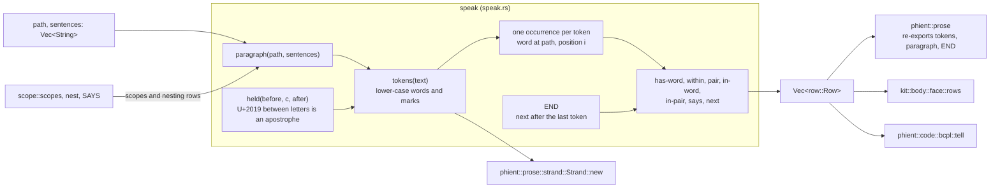

# speak

```mermaid
graph LR
    SentencesIn["path, sentences: Vec&lt;String&gt;"]
    ScopeIn["scope::scopes, nest, SAYS"]
    subgraph speakMod["speak (speak.rs)"]
        heldFn["held(before, c, after)<br/>U+2019 between letters is an apostrophe"]
        tokensFn["tokens(text)<br/>lower-case words and marks"]
        paragraphFn["paragraph(path, sentences)"]
        occRow["one occurrence per token<br/>word at path, position i"]
        rowKinds["has-word, within, pair, in-word,<br/>in-pair, says, next"]
        EndC["END<br/>next after the last token"]
    end
    RowsOut["Vec&lt;row::Row&gt;"]
    ProseRe["phient::prose<br/>re-exports tokens, paragraph, END"]
    FaceRows["kit::body::face::rows"]
    BcplTell["phient::code::bcpl::tell"]
    StrandNew["phient::prose::strand::Strand::new"]

    SentencesIn --> paragraphFn
    ScopeIn -->|"scopes and nesting rows"| paragraphFn
    paragraphFn --> tokensFn
    heldFn --> tokensFn
    tokensFn --> occRow
    occRow --> rowKinds
    EndC --> rowKinds
    rowKinds --> RowsOut
    RowsOut --> ProseRe
    RowsOut --> FaceRows
    RowsOut --> BcplTell
    tokensFn --> StrandNew
```
