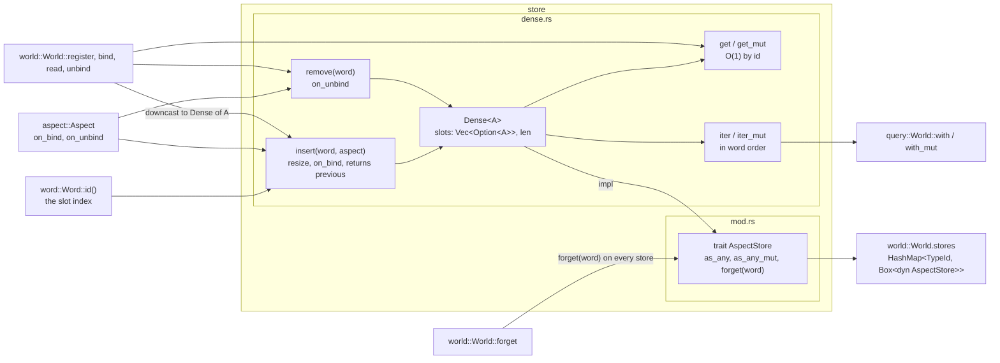

# store

```mermaid
graph LR
    WordId["word::Word::id()<br/>the slot index"]
    AspectHooks["aspect::Aspect<br/>on_bind, on_unbind"]
    subgraph storeMod["store"]
        subgraph modRs["mod.rs"]
            AspectStoreT["trait AspectStore<br/>as_any, as_any_mut, forget(word)"]
        end
        subgraph denseRs["dense.rs"]
            DenseT["Dense&lt;A&gt;<br/>slots: Vec&lt;Option&lt;A&gt;&gt;, len"]
            insertFn["insert(word, aspect)<br/>resize, on_bind, returns previous"]
            removeFn["remove(word)<br/>on_unbind"]
            getFn["get / get_mut<br/>O(1) by id"]
            iterFn["iter / iter_mut<br/>in word order"]
        end
    end
    WorldStores["world::World.stores<br/>HashMap&lt;TypeId, Box&lt;dyn AspectStore&gt;&gt;"]
    WorldBind["world::World::register, bind, read, unbind"]
    WorldForget["world::World::forget"]
    QueryWith["query::World::with / with_mut"]

    WordId --> insertFn
    AspectHooks --> insertFn
    AspectHooks --> removeFn
    insertFn --> DenseT
    removeFn --> DenseT
    DenseT --> getFn
    DenseT --> iterFn
    DenseT -->|"impl"| AspectStoreT
    AspectStoreT --> WorldStores
    WorldBind -->|"downcast to Dense of A"| insertFn
    WorldBind --> getFn
    WorldBind --> removeFn
    WorldForget -->|"forget(word) on every store"| AspectStoreT
    iterFn --> QueryWith
```
