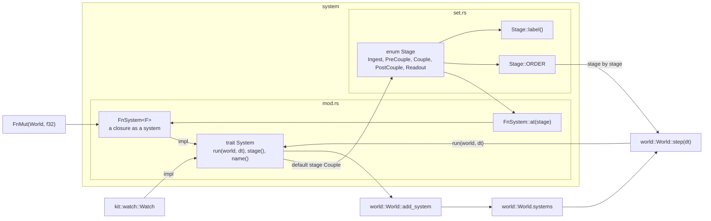

# system

```mermaid
graph LR
    ClosureIn["FnMut(World, f32)"]
    subgraph systemMod["system"]
        subgraph modRs["mod.rs"]
            SystemT["trait System<br/>run(world, dt), stage(), name()"]
            FnSystemT["FnSystem&lt;F&gt;<br/>a closure as a system"]
            atFn["FnSystem::at(stage)"]
        end
        subgraph setRs["set.rs"]
            StageT["enum Stage<br/>Ingest, PreCouple, Couple, PostCouple, Readout"]
            OrderC["Stage::ORDER"]
            labelFn["Stage::label()"]
        end
    end
    WatchSys["kit::watch::Watch"]
    AddSystem["world::World::add_system"]
    SystemsVec["world::World.systems"]
    StepFn["world::World::step(dt)"]

    ClosureIn --> FnSystemT
    atFn --> FnSystemT
    StageT --> atFn
    FnSystemT -->|"impl"| SystemT
    WatchSys -->|"impl"| SystemT
    SystemT -->|"default stage Couple"| StageT
    StageT --> OrderC
    StageT --> labelFn
    SystemT --> AddSystem
    AddSystem --> SystemsVec
    SystemsVec --> StepFn
    OrderC -->|"stage by stage"| StepFn
    StepFn -->|"run(world, dt)"| SystemT
```
