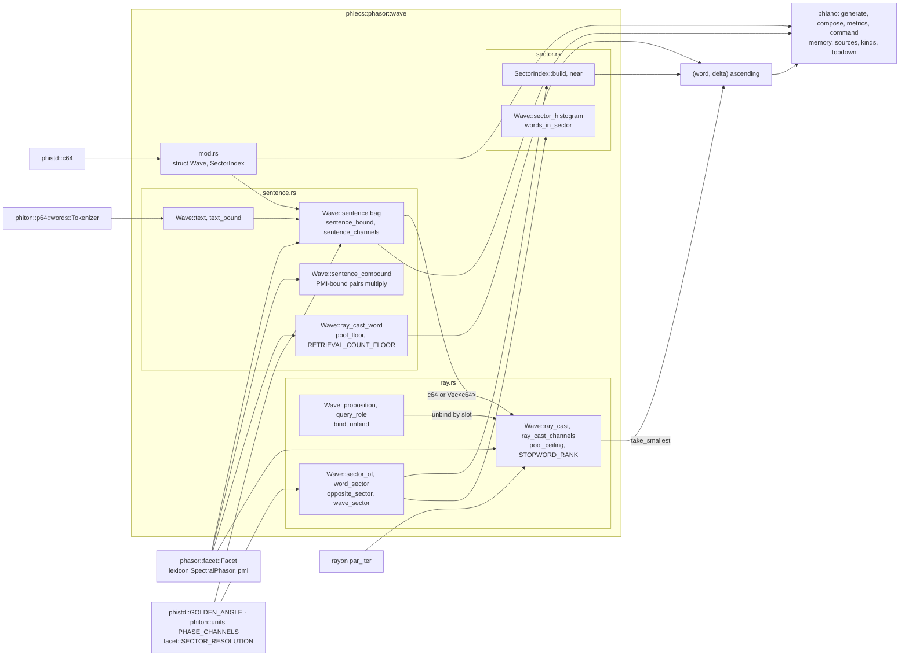

# phasor · wave

```mermaid
graph LR
    Facet["phasor::facet::Facet<br/>lexicon SpectralPhasor, pmi"]
    Tok["phiton::p64::words::Tokenizer"]
    Config["phistd::GOLDEN_ANGLE · phiton::units PHASE_CHANNELS<br/>facet::SECTOR_RESOLUTION"]
    NumC["phistd::c64"]
    Rayon["rayon par_iter"]

    subgraph wave["phiecs::phasor::wave"]
        C64["mod.rs<br/>struct Wave, SectorIndex"]
        subgraph sentencers["sentence.rs"]
            TextW["Wave::text, text_bound"]
            Sent["Wave::sentence bag<br/>sentence_bound, sentence_channels"]
            Compound["Wave::sentence_compound<br/>PMI-bound pairs multiply"]
            RCW["Wave::ray_cast_word<br/>pool_floor, RETRIEVAL_COUNT_FLOOR"]
        end
        subgraph rayrs["ray.rs"]
            RC["Wave::ray_cast, ray_cast_channels<br/>pool_ceiling, STOPWORD_RANK"]
            Prop["Wave::proposition, query_role<br/>bind, unbind"]
            SectorFn["Wave::sector_of, word_sector<br/>opposite_sector, wave_sector"]
        end
        subgraph sectorrs["sector.rs"]
            Index["SectorIndex::build, near"]
            Hist["Wave::sector_histogram<br/>words_in_sector"]
        end
    end

    Hits["(word, delta) ascending"]
    Users["phiano: generate, compose, metrics, command<br/>memory, sources, kinds, topdown"]

    NumC --> C64
    Tok --> TextW
    TextW --> Sent
    Facet --> Sent
    Config --> Sent
    Facet --> Compound
    C64 --> Sent
    Sent -->|"c64 or Vec&lt;c64&gt;"| RC
    Facet --> RC
    Rayon --> RC
    Facet --> RCW
    Prop -->|"unbind by slot"| RC
    RC -->|"take_smallest"| Hits
    RCW --> Hits
    Config --> SectorFn
    SectorFn --> Index
    SectorFn --> Hist
    Index --> Hits
    Sent --> Users
    C64 --> Users
    Hits --> Users
```
