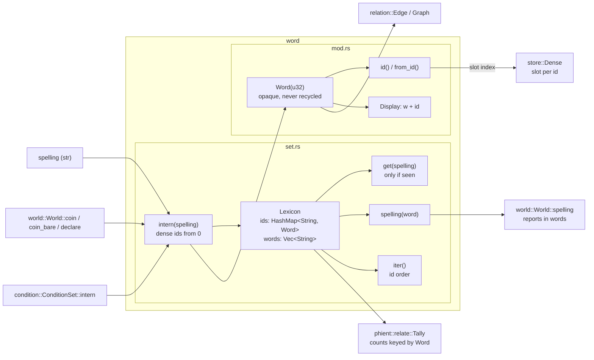

# word

```mermaid
graph LR
    SpellingIn["spelling (str)"]
    subgraph wordMod["word"]
        subgraph setRs["set.rs"]
            LexiconT["Lexicon<br/>ids: HashMap&lt;String, Word&gt;<br/>words: Vec&lt;String&gt;"]
            internFn["intern(spelling)<br/>dense ids from 0"]
            getFn["get(spelling)<br/>only if seen"]
            spellingFn["spelling(word)"]
            iterFn["iter()<br/>id order"]
        end
        subgraph modRs["mod.rs"]
            WordT["Word(u32)<br/>opaque, never recycled"]
            idFn["id() / from_id()"]
            displayFn["Display: w + id"]
        end
    end
    CoinIn["world::World::coin / coin_bare / declare"]
    CondSetIn["condition::ConditionSet::intern"]
    DenseSlot["store::Dense<br/>slot per id"]
    EdgeOut["relation::Edge / Graph"]
    TallyOut["phient::relate::Tally<br/>counts keyed by Word"]
    SpellOut["world::World::spelling<br/>reports in words"]

    SpellingIn --> internFn
    CoinIn --> internFn
    CondSetIn --> internFn
    internFn --> LexiconT
    internFn --> WordT
    LexiconT --> getFn
    LexiconT --> spellingFn
    LexiconT --> iterFn
    WordT --> idFn
    WordT --> displayFn
    idFn -->|"slot index"| DenseSlot
    WordT --> EdgeOut
    LexiconT --> TallyOut
    spellingFn --> SpellOut
```
