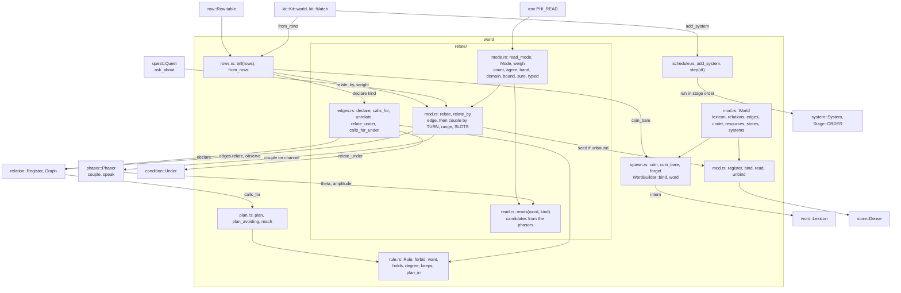

# world

```mermaid
graph TB
    RowsIn["row::Row table"]
    QuestIn["quest::Quest<br/>ask_about"]
    KitIn["kit::Kit::world, kit::Watch"]
    EnvIn["env PHI_READ"]
    subgraph worldMod["world"]
        WorldT["mod.rs: World<br/>lexicon, relations, edges, under, resources, stores, systems"]
        aspectsFn["mod.rs: register, bind, read, unbind"]
        spawnRs["spawn.rs: coin, coin_bare, forget<br/>WordBuilder::bind, word"]
        rowsRs["rows.rs: tell(rows), from_rows"]
        subgraph relateDir["relate/"]
            relateBy["mod.rs: relate, relate_by<br/>edge, then couple by TURN, range, SLOTS"]
            edgesRs["edges.rs: declare, calls_for, unrelate,<br/>relate_under, calls_for_under"]
            modeRs["mode.rs: read_mode, Mode, weigh<br/>count, agree, band, domain, bound, sure, typed"]
            readRs["read.rs: reads(word, kind)<br/>candidates from the phasors"]
        end
        planRs["plan.rs: plan, plan_avoiding, reach"]
        ruleRs["rule.rs: Rule, forbid, want,<br/>holds, degree, keeps, plan_in"]
        scheduleRs["schedule.rs: add_system, step(dt)"]
    end
    LexiconT["word::Lexicon"]
    RegisterT["relation::Register, Graph"]
    UnderT["condition::Under"]
    DenseT["store::Dense"]
    PhasorT["phasor::Phasor<br/>couple, speak"]
    SystemsT["system::System, Stage::ORDER"]

    RowsIn --> rowsRs
    KitIn -->|"from_rows"| rowsRs
    rowsRs -->|"declare kind"| edgesRs
    rowsRs -->|"coin_bare"| spawnRs
    rowsRs -->|"relate_by, weight"| relateBy
    QuestIn --> relateBy
    spawnRs -->|"intern"| LexiconT
    edgesRs -->|"declare"| RegisterT
    relateBy -->|"edges.relate, observe"| RegisterT
    relateBy -->|"seed if unbound"| aspectsFn
    aspectsFn --> DenseT
    relateBy -->|"couple on channel"| PhasorT
    EnvIn --> modeRs
    modeRs --> relateBy
    modeRs --> readRs
    PhasorT -->|"theta, amplitude"| readRs
    edgesRs -->|"relate_under"| UnderT
    RegisterT -->|"calls_for"| planRs
    planRs --> ruleRs
    edgesRs --> ruleRs
    KitIn -->|"add_system"| scheduleRs
    scheduleRs -->|"run in stage order"| SystemsT
    WorldT --> aspectsFn
    WorldT --> spawnRs
```
