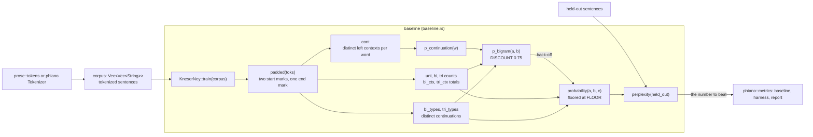

# baseline

```mermaid
graph LR
    TokIn["prose::tokens or phiano Tokenizer"]
    CorpusIn["corpus: Vec&lt;Vec&lt;String&gt;&gt;<br/>tokenized sentences"]
    HeldIn["held-out sentences"]
    subgraph baselineMod["baseline (baseline.rs)"]
        trainFn["KneserNey::train(corpus)"]
        paddedFn["padded(toks)<br/>two start marks, one end mark"]
        countsN["uni, bi, tri counts<br/>bi_ctx, tri_ctx totals"]
        typesN["bi_types, tri_types<br/>distinct continuations"]
        contN["cont<br/>distinct left contexts per word"]
        pCont["p_continuation(w)"]
        pBigram["p_bigram(a, b)<br/>DISCOUNT 0.75"]
        probFn["probability(a, b, c)<br/>floored at FLOOR"]
        pplFn["perplexity(held_out)"]
    end
    MetricsOut["phiano::metrics: baseline, harness, report"]

    TokIn --> CorpusIn
    CorpusIn --> trainFn
    trainFn --> paddedFn
    paddedFn --> countsN
    paddedFn --> typesN
    paddedFn --> contN
    contN --> pCont
    pCont --> pBigram
    countsN --> pBigram
    typesN --> pBigram
    pBigram -->|"back-off"| probFn
    countsN --> probFn
    typesN --> probFn
    HeldIn --> pplFn
    probFn --> pplFn
    pplFn -->|"the number to beat"| MetricsOut
```
