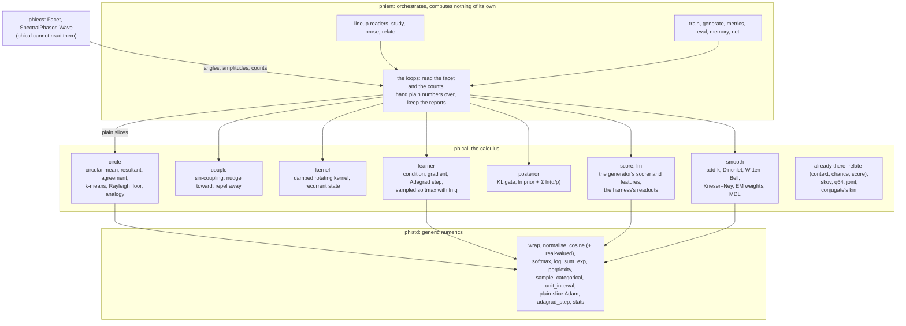
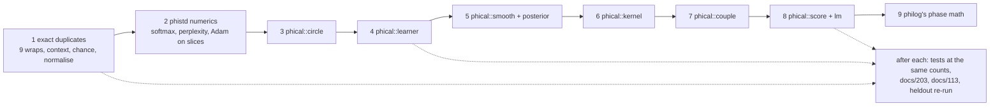

# calculations — architecture

## Where the math lives after the move

```mermaid
graph TB
    subgraph phient["phient: orchestrates, computes nothing of its own"]
        Readers["lineup readers, study, prose, relate"]
        Drivers["train, generate, metrics, eval, memory, net"]
        Loops["the loops: read the facet and the counts,<br/>hand plain numbers over, keep the reports"]
    end
    subgraph phical["phical: the calculus"]
        Circle["circle<br/>circular mean, resultant, agreement,<br/>k-means, Rayleigh floor, analogy"]
        Couple["couple<br/>sin-coupling: nudge toward, repel away"]
        Kernel["kernel<br/>damped rotating kernel, recurrent state"]
        Smooth["smooth<br/>add-k, Dirichlet, Witten–Bell,<br/>Kneser–Ney, EM weights, MDL"]
        Posterior["posterior<br/>KL gate, ln prior + Σ ln(d/p)"]
        Learner["learner<br/>condition, gradient, Adagrad step,<br/>sampled softmax with ln q"]
        Score["score, lm<br/>the generator's scorer and features,<br/>the harness's readouts"]
        Have["already there: relate (context, chance, score),<br/>liskov, q64, joint, conjugate's kin"]
    end
    subgraph phistd["phistd: generic numerics"]
        Num["wrap, normalise, cosine (+ real-valued),<br/>softmax, log_sum_exp, perplexity,<br/>sample_categorical, unit_interval,<br/>plain-slice Adam, adagrad_step, stats"]
    end
    Facet["phiecs: Facet, SpectralPhasor, Wave<br/>(phical cannot read them)"]

    Facet -->|"angles, amplitudes, counts"| Loops
    Readers --> Loops
    Drivers --> Loops
    Loops -->|"plain slices"| Circle
    Loops --> Couple
    Loops --> Kernel
    Loops --> Smooth
    Loops --> Posterior
    Loops --> Learner
    Loops --> Score
    Circle --> Num
    Learner --> Num
    Score --> Num
    Smooth --> Num
```

## The batches, in order

```mermaid
graph LR
    B1["1 exact duplicates<br/>9 wraps, context, chance, normalise"]
    B2["2 phistd numerics<br/>softmax, perplexity, Adam on slices"]
    B3["3 phical::circle"]
    B4["4 phical::learner"]
    B5["5 phical::smooth + posterior"]
    B6["6 phical::kernel"]
    B7["7 phical::couple"]
    B8["8 phical::score + lm"]
    B9["9 philog's phase math"]
    Check["after each: tests at the same counts,<br/>docs/203, docs/113, heldout re-run"]
    B1 --> B2 --> B3 --> B4 --> B5 --> B6 --> B7 --> B8 --> B9
    B1 -.-> Check
    B4 -.-> Check
    B8 -.-> Check
```
