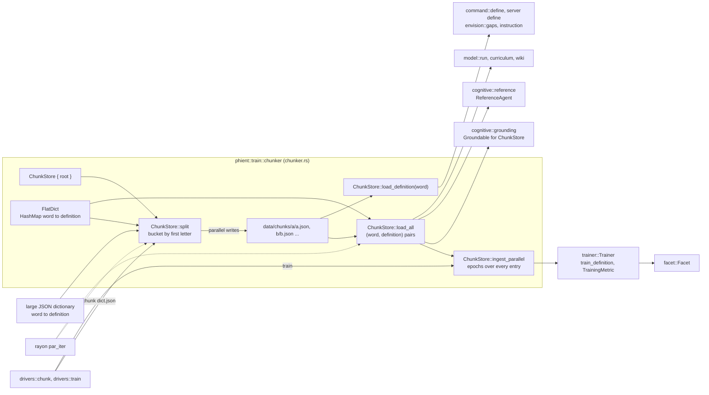

# train · chunker

```mermaid
graph LR
    Dict["large JSON dictionary<br/>word to definition"]
    Rayon["rayon par_iter"]
    Trainer["trainer::Trainer<br/>train_definition, TrainingMetric"]
    Facet["facet::Facet"]
    Drivers["drivers::chunk, drivers::train"]

    subgraph chunker["phient::train::chunker (chunker.rs)"]
        Store["ChunkStore { root }"]
        Flat["FlatDict<br/>HashMap word to definition"]
        Split["ChunkStore::split<br/>bucket by first letter"]
        Chunks["data/chunks/a/a.json, b/b.json ..."]
        LoadAll["ChunkStore::load_all<br/>(word, definition) pairs"]
        LoadDef["ChunkStore::load_definition(word)"]
        Ingest["ChunkStore::ingest_parallel<br/>epochs over every entry"]
    end

    Grounding["cognitive::grounding<br/>Groundable for ChunkStore"]
    Reference["cognitive::reference<br/>ReferenceAgent"]
    Define["command::define, server define<br/>envision::gaps, instruction"]
    Startup["model::run, curriculum, wiki"]

    Drivers -->|"chunk dict.json"| Split
    Dict --> Split
    Flat --> Split
    Store --> Split
    Rayon -.-> Split
    Split -->|"parallel writes"| Chunks
    Chunks --> LoadAll
    Rayon -.-> LoadAll
    Flat --> LoadAll
    Chunks --> LoadDef
    Drivers -->|"train"| Ingest
    LoadAll --> Ingest
    Ingest --> Trainer
    Trainer --> Facet
    LoadAll --> Grounding
    LoadAll --> Reference
    LoadAll --> Startup
    LoadDef --> Define
```
