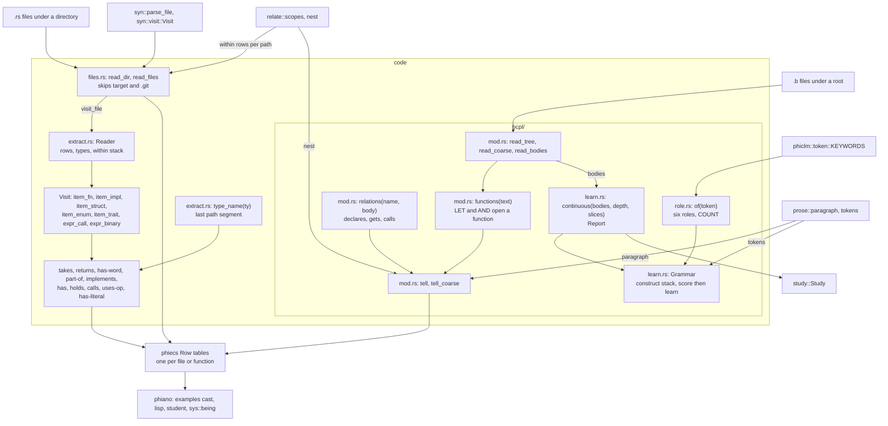

# code

```mermaid
graph TB
    RsFiles[".rs files under a directory"]
    BFiles[".b files under a root"]
    SynIn["syn::parse_file, syn::visit::Visit"]
    subgraph codeMod["code"]
        filesRs["files.rs: read_dir, read_files<br/>skips target and .git"]
        extractRs["extract.rs: Reader<br/>rows, types, within stack"]
        visitFns["Visit: item_fn, item_impl, item_struct,<br/>item_enum, item_trait, expr_call, expr_binary"]
        typeName["extract.rs: type_name(ty)<br/>last path segment"]
        relKinds["takes, returns, has-word, part-of, implements,<br/>has, holds, calls, uses-op, has-literal"]
        subgraph bcplDir["bcpl/"]
            functionsFn["mod.rs: functions(text)<br/>LET and AND open a function"]
            relationsFn["mod.rs: relations(name, body)<br/>declares, gets, calls"]
            tellFns["mod.rs: tell, tell_coarse"]
            readTree["mod.rs: read_tree, read_coarse, read_bodies"]
            roleRs["role.rs: of(token)<br/>six roles, COUNT"]
            learnRs["learn.rs: Grammar<br/>construct stack, score then learn"]
            continuousFn["learn.rs: continuous(bodies, depth, slices)<br/>Report"]
        end
    end
    ScopesIn["relate::scopes, nest"]
    ProseIn["prose::paragraph, tokens"]
    KeywordsIn["phiclm::token::KEYWORDS"]
    StudyOut["study::Study"]
    RowsOut["phiecs Row tables<br/>one per file or function"]
    PhianoOut["phiano: examples cast, lisp, student, sys::being"]

    RsFiles --> filesRs
    SynIn --> filesRs
    filesRs -->|"visit_file"| extractRs
    extractRs --> visitFns
    visitFns --> relKinds
    typeName --> relKinds
    ScopesIn -->|"within rows per path"| filesRs
    relKinds --> RowsOut
    filesRs --> RowsOut
    BFiles --> readTree
    readTree --> functionsFn
    functionsFn --> tellFns
    relationsFn --> tellFns
    ProseIn -->|"paragraph"| tellFns
    ScopesIn -->|"nest"| tellFns
    tellFns --> RowsOut
    readTree -->|"bodies"| continuousFn
    continuousFn --> learnRs
    KeywordsIn --> roleRs
    roleRs --> learnRs
    ProseIn -->|"tokens"| learnRs
    continuousFn --> StudyOut
    RowsOut --> PhianoOut
```
