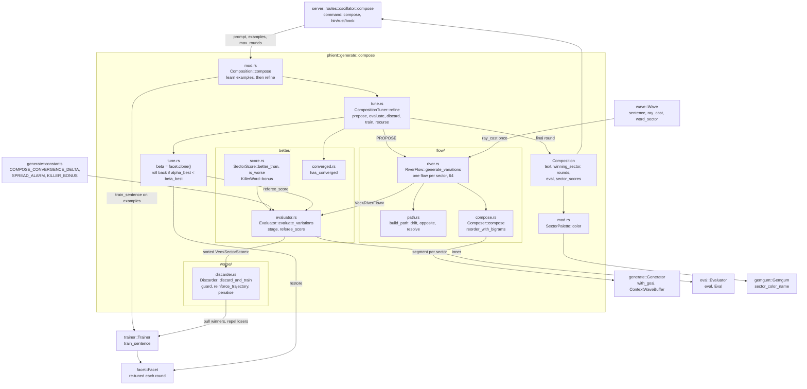

# compose

```mermaid
graph TB
    Callers["server::routes::oscillator::compose<br/>command::compose, bin/rust/book"]
    Trainer["trainer::Trainer<br/>train_sentence"]
    FacetN["facet::Facet<br/>re-tuned each round"]
    WaveN["wave::Wave<br/>sentence, ray_cast, word_sector"]
    GenN["generate::Generator<br/>with_goal, ContextWaveBuffer"]
    EvalN["eval::Evaluator<br/>eval, Eval"]
    Gemgum["gemgum::Gemgum<br/>sector_color_name"]
    Config["generate::constants<br/>COMPOSE_CONVERGENCE_DELTA,<br/>SPREAD_ALARM, KILLER_BONUS"]

    subgraph compose["phient::generate::compose"]
        ModC["mod.rs<br/>Composition::compose<br/>learn examples, then refine"]
        Palette["mod.rs<br/>SectorPalette::color"]
        Tune["tune.rs<br/>CompositionTuner::refine<br/>propose, evaluate, discard, train, recurse"]
        Beta["tune.rs<br/>beta = facet.clone()<br/>roll back if alpha_best &lt; beta_best"]

        subgraph flow["flow/"]
            River["river.rs<br/>RiverFlow::generate_variations<br/>one flow per sector, 64"]
            PathN["path.rs<br/>build_path: drift, opposite, resolve"]
            Composer["compose.rs<br/>Composer::compose<br/>reorder_with_bigrams"]
        end

        subgraph better["better/"]
            Evaluator["evaluator.rs<br/>Evaluator::evaluate_variations<br/>stage, referee_score"]
            Score["score.rs<br/>SectorScore::better_than, is_worse<br/>KillerWord::bonus"]
            Converged["converged.rs<br/>has_converged"]
        end

        subgraph worse["worse/"]
            Discarder["discarder.rs<br/>Discarder::discard_and_train<br/>guard, reinforce_trajectory, penalise"]
        end

        Result["Composition<br/>text, winning_sector, rounds,<br/>eval, sector_scores"]
    end

    Callers -->|"prompt, examples, max_rounds"| ModC
    ModC -->|"train_sentence on examples"| Trainer
    ModC --> Tune
    Tune -->|"PROPOSE"| River
    WaveN -->|"ray_cast once"| River
    River --> PathN
    River --> Composer
    Composer -->|"segment per sector"| GenN
    River -->|"Vec&lt;RiverFlow&gt;"| Evaluator
    Score --> Evaluator
    Config --> Evaluator
    Evaluator -->|"inner"| EvalN
    Evaluator -->|"sorted Vec&lt;SectorScore&gt;"| Discarder
    Discarder -->|"pull winners, repel losers"| Trainer
    Trainer --> FacetN
    Tune --> Beta
    Beta -->|"referee_score"| Evaluator
    Beta -->|"restore"| FacetN
    Tune --> Converged
    Tune -->|"final round"| Result
    Palette --> Gemgum
    Result --> Palette
    Result --> Callers
```
