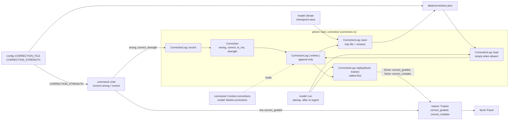

# train · correction

`phient::train::correction` — it was phiano's `correction`.

```mermaid
graph LR
    Chat["command::chat<br/>!correct wrong / correct"]
    Ctx["command::Context.corrections<br/>model::Model.corrections"]
    Trainer["trainer::Trainer<br/>correct_graded, correct_mistake"]
    Facet["facet::Facet"]
    Config["config::CORRECTION_FILE<br/>CORRECTION_STRENGTH"]
    Json["data/corrections.json"]
    Run["model::run<br/>startup, after re-ingest"]
    Iterate["model::iterate<br/>checkpoint save"]

    subgraph correction["phient::train::correction (correction.rs)"]
        Entry["Correction<br/>wrong, correct, ts_ms, strength"]
        Log["CorrectionLog { entries }<br/>append-only"]
        Record["CorrectionLog::record"]
        Replay["CorrectionLog::replay(facet, trainer)<br/>oldest first"]
        Save["CorrectionLog::save<br/>tmp file + rename"]
        Load["CorrectionLog::load<br/>empty when absent"]
    end

    Chat -->|"live correct_graded"| Trainer
    Chat -->|"wrong, correct, strength"| Record
    Config -->|"CORRECTION_STRENGTH"| Chat
    Record --> Entry
    Entry --> Log
    Ctx -.->|"holds"| Log
    Iterate --> Save
    Log --> Save
    Save --> Json
    Config --> Json
    Json --> Load
    Run --> Load
    Load --> Log
    Run --> Replay
    Log --> Replay
    Replay -->|"Some: correct_graded, None: correct_mistake"| Trainer
    Trainer --> Facet
```
