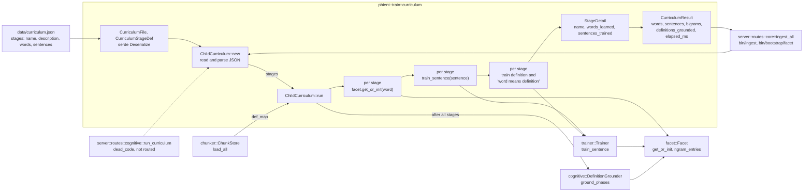

# train · curriculum

`phient::train::curriculum` — it was phiano's `curriculum`.

```mermaid
graph LR
    Json["data/curriculum.json<br/>stages: name, description, words, sentences"]
    Callers["server::routes::core::ingest_all<br/>bin/ingest, bin/bootstrap/facet"]
    Unrouted["server::routes::cognitive::run_curriculum<br/>dead_code, not routed"]
    Chunks["chunker::ChunkStore<br/>load_all"]
    TrainerN["trainer::Trainer<br/>train_sentence"]
    FacetN["facet::Facet<br/>get_or_init, ngram_entries"]
    Grounder["cognitive::DefinitionGrounder<br/>ground_phases"]

    subgraph curriculum["phient::train::curriculum"]
        Defs["CurriculumFile, CurriculumStageDef<br/>serde Deserialize"]
        New["ChildCurriculum::new<br/>read and parse JSON"]
        Run["ChildCurriculum::run"]
        Words["per stage<br/>facet.get_or_init(word)"]
        Sentences["per stage<br/>train_sentence(sentence)"]
        Linked["per stage<br/>train definition and<br/>'word means definition'"]
        Detail["StageDetail<br/>name, words_learned, sentences_trained"]
        Result["CurriculumResult<br/>words, sentences, bigrams,<br/>definitions_grounded, elapsed_ms"]
    end

    Json --> Defs
    Defs --> New
    Callers --> New
    Unrouted -.-> New
    New -->|"stages"| Run
    Chunks -->|"def_map"| Run
    Run --> Words
    Words --> Sentences
    Sentences --> Linked
    Words --> FacetN
    Sentences --> TrainerN
    Linked --> TrainerN
    TrainerN --> FacetN
    Linked --> Detail
    Run -->|"after all stages"| Grounder
    Grounder --> FacetN
    Detail --> Result
    Result --> Callers
```
