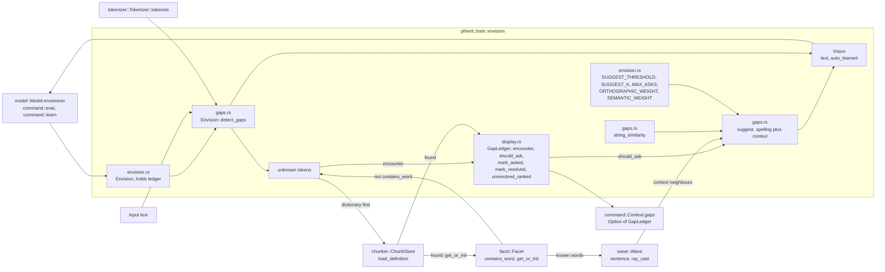

# train · envision

`phient::train::envision` — it was phiano's `envision`.

```mermaid
graph LR
    Callers["model::Model.envisioner<br/>command::eval, command::learn"]
    Text["input text"]
    Tok["tokenizer::Tokenizer::tokenize"]
    FacetN["facet::Facet<br/>contains_word, get_or_init"]
    Chunks["chunker::ChunkStore<br/>load_definition"]
    WaveN["wave::Wave<br/>sentence, ray_cast"]
    CtxGaps["command::Context.gaps<br/>Option of GapLedger"]

    subgraph envision["phient::train::envision"]
        Env["envision.rs<br/>Envision, holds ledger"]
        Consts["envision.rs<br/>SUGGEST_THRESHOLD, SUGGEST_K, MAX_ASKS,<br/>ORTHOGRAPHIC_WEIGHT, SEMANTIC_WEIGHT"]
        Detect["gaps.rs<br/>Envision::detect_gaps"]
        Unknown["unknown tokens"]
        Suggest["gaps.rs<br/>suggest, spelling plus context"]
        Similar["gaps.rs<br/>string_similarity"]
        Ledger["display.rs<br/>GapLedger: encounter, should_ask,<br/>mark_asked, mark_resolved, unresolved_ranked"]
        Vision["Vision<br/>text, auto_learned"]
    end

    Callers --> Env
    Env --> Detect
    Text --> Detect
    Tok --> Detect
    FacetN -->|"not contains_word"| Unknown
    Detect --> Unknown
    Unknown -->|"encounter"| Ledger
    Unknown -->|"dictionary first"| Chunks
    Chunks -->|"found: get_or_init"| FacetN
    Chunks -->|"found"| Ledger
    Ledger -->|"should_ask"| Suggest
    FacetN -->|"known words"| WaveN
    WaveN -->|"context neighbours"| Suggest
    Similar --> Suggest
    Consts --> Suggest
    Suggest --> Vision
    Detect --> Vision
    Vision --> Callers
    Ledger --> CtxGaps
```
