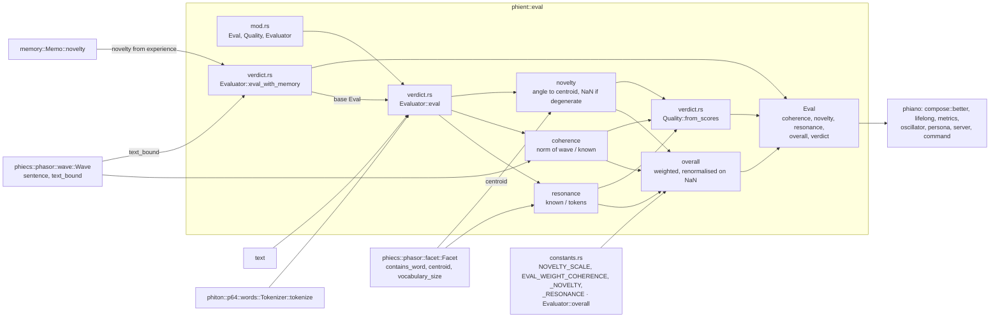

# eval

```mermaid
graph LR
    Text["text"]
    Tok["phiton::p64::words::Tokenizer::tokenize"]
    FacetN["phiecs::phasor::facet::Facet<br/>contains_word, centroid, vocabulary_size"]
    WaveN["phiecs::phasor::wave::Wave<br/>sentence, text_bound"]
    MemoN["memory::Memo::novelty"]
    Config["constants.rs<br/>NOVELTY_SCALE, EVAL_WEIGHT_COHERENCE, _NOVELTY,<br/>_RESONANCE · Evaluator::overall"]
    Users["phiano: compose::better, lifelong, metrics,<br/>oscillator, persona, server, command"]

    subgraph eval["phient::eval"]
        Types["mod.rs<br/>Eval, Quality, Evaluator"]
        EvalFn["verdict.rs<br/>Evaluator::eval"]
        Resonance["resonance<br/>known / tokens"]
        Coherence["coherence<br/>norm of wave / known"]
        Novelty["novelty<br/>angle to centroid, NaN if degenerate"]
        Combined["overall<br/>weighted, renormalised on NaN"]
        FromScores["verdict.rs<br/>Quality::from_scores"]
        WithMemory["verdict.rs<br/>Evaluator::eval_with_memory"]
        EvalOut["Eval<br/>coherence, novelty, resonance,<br/>overall, verdict"]
    end

    Types --> EvalFn
    Text --> EvalFn
    Tok --> EvalFn
    EvalFn --> Resonance
    FacetN --> Resonance
    EvalFn --> Coherence
    WaveN --> Coherence
    EvalFn --> Novelty
    FacetN -->|"centroid"| Novelty
    Coherence --> Combined
    Resonance --> Combined
    Novelty --> Combined
    Config --> Combined
    Coherence --> FromScores
    Resonance --> FromScores
    Novelty --> FromScores
    Combined --> EvalOut
    FromScores --> EvalOut
    WithMemory -->|"base Eval"| EvalFn
    WaveN -->|"text_bound"| WithMemory
    MemoN -->|"novelty from experience"| WithMemory
    WithMemory --> EvalOut
    EvalOut --> Users
```
