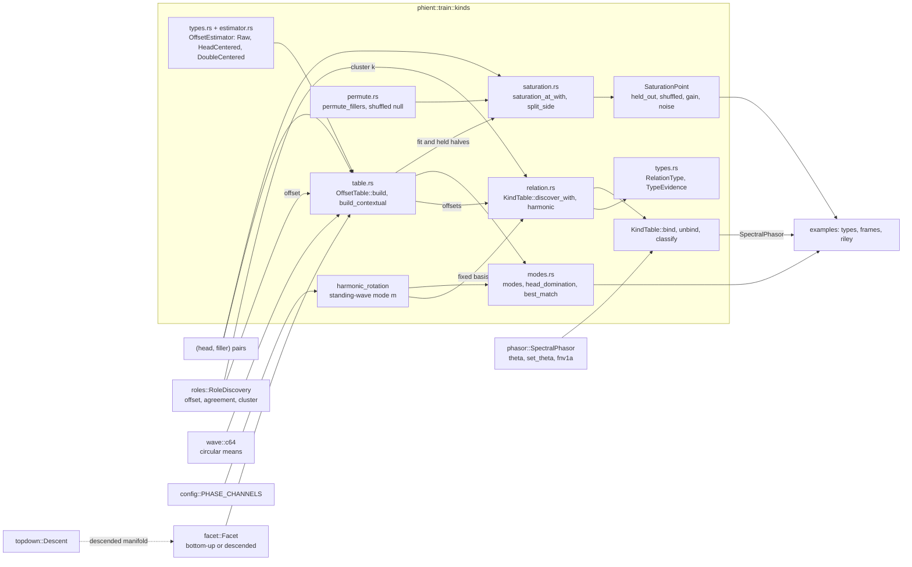

# train · kinds

`phient::train::kinds` — it was phiano's `kinds`.

```mermaid
graph LR
    Pairs["(head, filler) pairs"]
    Facet["facet::Facet<br/>bottom-up or descended"]
    Roles["roles::RoleDiscovery<br/>offset, agreement, cluster"]
    Phasor["phasor::SpectralPhasor<br/>theta, set_theta, fnv1a"]
    C64["wave::c64<br/>circular means"]
    Config["config::PHASE_CHANNELS"]
    Topdown["topdown::Descent"]

    subgraph kinds["phient::train::kinds"]
        Est["types.rs + estimator.rs<br/>OffsetEstimator: Raw, HeadCentered, DoubleCentered"]
        Table["table.rs<br/>OffsetTable::build, build_contextual"]
        Modes["modes.rs<br/>modes, head_domination, best_match"]
        Harm["harmonic_rotation<br/>standing-wave mode m"]
        Discover["relation.rs<br/>KindTable::discover_with, harmonic"]
        Handles["types.rs<br/>RelationType, TypeEvidence"]
        Ops["KindTable::bind, unbind, classify"]
        Perm["permute.rs<br/>permute_fillers, shuffled null"]
        Sat["saturation.rs<br/>saturation_at_with, split_side"]
        Point["SaturationPoint<br/>held_out, shuffled, gain, noise"]
    end

    Examples["examples: types, frames, riley"]

    Topdown -.->|"descended manifold"| Facet
    Pairs --> Table
    Facet --> Table
    Est --> Table
    Roles -->|"offset"| Table
    C64 --> Table
    Table -->|"offsets"| Discover
    Roles -->|"cluster k"| Discover
    Config --> Harm
    Harm -->|"fixed basis"| Discover
    Harm --> Modes
    Table --> Modes
    Discover --> Handles
    Discover --> Ops
    Phasor --> Ops
    Pairs --> Sat
    Perm --> Sat
    Table -->|"fit and held halves"| Sat
    Sat --> Point
    Ops -->|"SpectralPhasor"| Examples
    Point --> Examples
    Modes --> Examples
```
