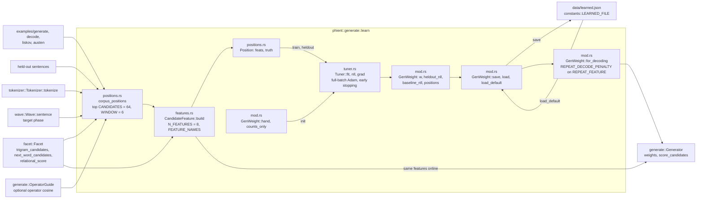

# learn

```mermaid
graph LR
    Corpus["held-out sentences"]
    Tok["tokenizer::Tokenizer::tokenize"]
    FacetN["facet::Facet<br/>trigram_candidates, next_word_candidates,<br/>relational_score"]
    WaveN["wave::Wave::sentence<br/>target phase"]
    Guide["generate::OperatorGuide<br/>optional operator cosine"]
    Examples["examples/generate, decode,<br/>liskov, austen"]
    Json["data/learned.json<br/>constants::LEARNED_FILE"]
    GenN["generate::Generator<br/>weights, score_candidates"]

    subgraph learn["phient::generate::learn"]
        Positions["positions.rs<br/>corpus_positions<br/>top CANDIDATES = 64, WINDOW = 6"]
        Features["features.rs<br/>CandidateFeature::build<br/>N_FEATURES = 8, FEATURE_NAMES"]
        Position["positions.rs<br/>Position: feats, truth"]
        Baselines["mod.rs<br/>GenWeight::hand, counts_only"]
        Tuner["tuner.rs<br/>Tuner::fit, nll, grad<br/>full-batch Adam, early stopping"]
        Weight["mod.rs<br/>GenWeight: w, heldout_nll,<br/>baseline_nll, positions"]
        Io["mod.rs<br/>GenWeight::save, load, load_default"]
        ForDecoding["mod.rs<br/>GenWeight::for_decoding<br/>REPEAT_DECODE_PENALTY on REPEAT_FEATURE"]
    end

    Examples --> Positions
    Corpus --> Positions
    Tok --> Positions
    FacetN --> Positions
    WaveN --> Positions
    Guide --> Positions
    Positions --> Features
    FacetN --> Features
    Features --> Position
    Position -->|"train, heldout"| Tuner
    Baselines -->|"init"| Tuner
    Tuner --> Weight
    Weight --> Io
    Io -->|"save"| Json
    Json -->|"load_default"| Io
    Io --> ForDecoding
    ForDecoding --> GenN
    Features -->|"same features online"| GenN
```
