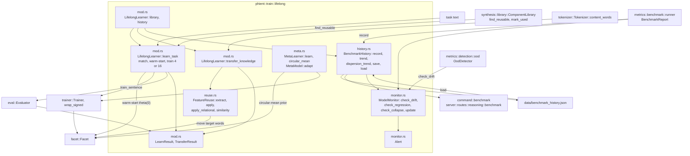

# train · lifelong

`phient::train::lifelong` — it was phiano's `lifelong`.

```mermaid
graph TB
    Task["task text"]
    Library["synthesis::library::ComponentLibrary<br/>find_reusable, mark_used"]
    FacetN["facet::Facet"]
    TrainerN["trainer::Trainer, wrap_signed"]
    EvalN["eval::Evaluator"]
    Tok["tokenizer::Tokenizer::content_words"]
    Report["metrics::benchmark::runner<br/>BenchmarkReport"]
    DriftOod["metrics::detection::ood<br/>OodDetector"]
    HistFile["data/benchmark_history.json"]
    Users["command::benchmark<br/>server::routes::reasoning::benchmark"]

    subgraph lifelong["phient::train::lifelong"]
        Learner["mod.rs<br/>LifelongLearner: library, history"]
        LearnTask["mod.rs<br/>LifelongLearner::learn_task<br/>match, warm-start, train 4 or 16"]
        Transfer["mod.rs<br/>LifelongLearner::transfer_knowledge"]
        Results["mod.rs<br/>LearnResult, TransferResult"]
        Meta["meta.rs<br/>MetaLearner::learn, circular_mean<br/>MetaModel::adapt"]
        Reuse["reuse.rs<br/>FeatureReuse::extract, apply,<br/>apply_relational, similarity"]
        History["history.rs<br/>BenchmarkHistory: record, trend,<br/>dispersion_trend, save, load"]
        Monitor["monitor.rs<br/>ModelMonitor: check_drift,<br/>check_regression, check_collapse, update"]
        AlertN["monitor.rs<br/>Alert"]
    end

    Task --> LearnTask
    Learner --> LearnTask
    Learner --> Transfer
    Learner --> History
    Library -->|"find_reusable"| LearnTask
    LearnTask -->|"warm-start theta(0)"| FacetN
    LearnTask -->|"train_sentence"| TrainerN
    TrainerN --> FacetN
    LearnTask --> EvalN
    EvalN --> Results
    LearnTask --> Results
    Tok --> Transfer
    Transfer --> Reuse
    Reuse -->|"move target words"| FacetN
    Transfer --> Results
    Meta -->|"circular-mean prior"| FacetN
    Meta --> TrainerN
    Report -->|"record"| History
    History --> HistFile
    HistFile -->|"load"| History
    History --> Users
    Report --> Monitor
    History --> Monitor
    DriftOod -->|"check_drift"| Monitor
    Monitor --> AlertN
```
