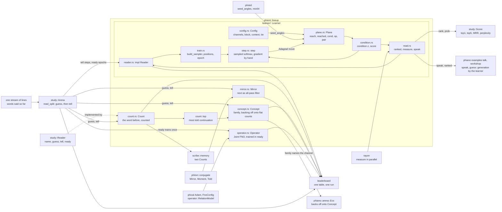

# lineup

```mermaid
graph LR
    Stream["one stream of lines<br/>words said so far"]
    Study["study::Arena<br/>read_split: guess, then tell"]
    ReaderT["study::Reader<br/>name, guess, tell, ready"]
    Phical["phiton::conjugate<br/>Mirror, Moment, Told"]
    Fno["phical Adam, FnoConfig<br/>operator::RelationModel"]
    Phistd["phistd<br/>seed_angles, mix64"]
    Rayon["rayon<br/>measure in parallel"]
    ScoreT["study::Score<br/>top1, top5, MRR, perplexity"]

    subgraph lineup["phient::lineup"]
        Count["count.rs: Count<br/>the word before, counted"]
        Top["count::top<br/>most told continuation"]
        Concept["concept.rs: Concept<br/>family, backing off onto flat counts"]
        Mirror["mirror.rs: Mirror<br/>next as all-pass filter"]
        Operator["operator.rs: Operator<br/>Joint FNO, trained in ready"]
        subgraph learner["learner/: Learner"]
            LConfig["config.rs: Config<br/>channels, block, context, tie"]
            Plane["plane.rs: Plane<br/>reach, reached, cond, op, pair"]
            Condition["condition.rs<br/>condition z, score"]
            Step["step.rs: step<br/>sampled softmax, gradient by hand"]
            Train["train.rs<br/>build_sampler, positions, epoch"]
            Read["read.rs<br/>ranked, measure, speak"]
            LReader["reader.rs: impl Reader"]
        end
    end

    Board["leaderboard<br/>one table, one run"]
    Ecs["phiano::arena::Ecs<br/>backs off onto Concept"]
    Scribe["scribe::memory<br/>two Counts"]
    Talk["phiano examples talk, workshop<br/>speak, guess: generation by the learner"]

    Stream --> Study
    ReaderT -.->|"implemented by"| Count
    Study -->|"guess, tell"| Count
    Study -->|"guess, tell"| Concept
    Study -->|"guess, tell"| Mirror
    Study -->|"ready trains once"| Operator
    Study -->|"tell steps, ready epochs"| LReader
    Count --> Top
    Top --> Concept
    Concept -->|"family names the channel"| Ecs
    Phical --> Mirror
    Fno --> Operator
    LConfig --> Plane
    Phistd -->|"seed_angles"| Plane
    LReader --> Train
    Train --> Step
    Plane --> Condition
    Condition --> Step
    Step -->|"Adagrad move"| Plane
    Condition --> Read
    Rayon --> Read
    Read -->|"rank, prob"| ScoreT
    Read --> LReader
    Read -->|"speak, ranked"| Talk
    Count --> Board
    Concept --> Board
    Mirror --> Board
    Operator --> Board
    LReader --> Board
    Study --> Board
    Count --> Scribe
```
