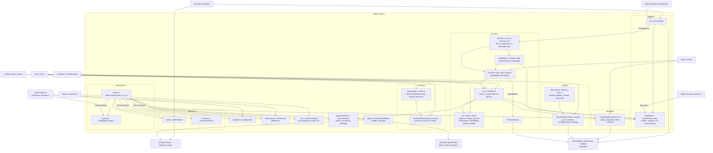

# metrics

```mermaid
graph TB
    Facet["facet::Facet"]
    Trainer["trainer::Trainer"]
    Tok["tokenizer::Tokenizer"]
    Evaluator["eval::Evaluator<br/>coherence, resonance"]
    Kernel["config::channel_kernel"]
    Readout["nonlinear::SectorReadout"]
    PhientKN["phient::baseline::KneserNey"]
    Corpus["data/rust_book_corpus.txt"]
    ArcJson["data/arc_tasks.json"]

    subgraph metrics["phient::metrics"]
        subgraph harness["harness/"]
            Harness["harness.rs, run.rs: Harness::run<br/>KN vs contrastive vs attraction-only"]
            Split["perplexity.rs: Harness::split<br/>Split 80/10/10, no leakage"]
            TrainMeasure["Harness::train_and_measure<br/>EpochMetric per epoch"]
            LM["lm.rs: PhianoLM<br/>counts + phase back-off, gamma"]
            LMParts["lm/: context, affine, advance, sweep, gamma<br/>ContextKind, SweepRow, gamma_sweep"]
            HReport["HarnessReport"]
        end
        subgraph baseline["baseline/"]
            BSet["baseline.rs: BaselineSet::suite<br/>uniform, unigram, KN, counts, phase"]
            KN["kn.rs: KneserNey"]
        end
        subgraph relation["relation/"]
            RelBench["RelationBenchmark::evaluate<br/>pair vs random, neighbourhood, analogy"]
            Families["benchmark/: family.rs, rank.rs<br/>default_families, nearest, pool_size"]
        end
        subgraph sentence["sentence/"]
            SentBench["SentenceBenchmark::evaluate<br/>phase vs lexical vs chance"]
            Encoding["benchmark.rs, state.rs<br/>SentenceEncoding Bag, Bound, Recurrent"]
        end
        subgraph forgetting["forgetting/"]
            Forget["ForgettingBenchmark::run<br/>ceiling, sequential, floor: retention"]
        end
        subgraph detection["detection/"]
            Ood["ood.rs: OodDetector"]
            Shortcut["shortcut.rs: ShortcutDetector"]
        end
        subgraph benchmark["benchmark/"]
            Runner["runner.rs: BenchmarkRunner::run_all"]
            Novelty["novelty.rs: NoveltyBenchmark"]
        end
        Adapt["adaptation.rs: Adaptation"]
        Adv["adversarial.rs: Adversarial<br/>brittleness"]
        Arc["arc.rs: ArcBenchmark<br/>text analogy, not ARC-AGI"]
        Gen["generalization.rs: Generalization<br/>split by vocabulary coverage"]
        BReport["report.rs: BenchmarkReport<br/>Display, compare"]
    end

    BenchUsers["command::benchmark<br/>server routes reasoning"]
    Lifelong["lifelong::history, lifelong::monitor"]
    Bins["bin/evaluate, bin/persona, bin/bpe<br/>examples"]

    Harness --> Split
    Harness --> TrainMeasure
    Split --> TrainMeasure
    Trainer --> TrainMeasure
    TrainMeasure --> LM
    Facet --> LM
    Readout --> LM
    LM --> LMParts
    Kernel --> LMParts
    TrainMeasure -->|"EpochMetric"| HReport
    PhientKN --> KN
    Tok --> KN
    KN -->|"KN perplexity"| Harness
    Corpus -->|"load_split"| BSet
    Split --> BSet
    KN --> BSet
    LM --> BSet
    LM --> Gen
    LM --> Forget
    Trainer --> Forget
    Families --> RelBench
    Facet --> RelBench
    Kernel --> Encoding
    Encoding --> SentBench
    Facet --> SentBench
    Runner --> BSet
    Runner --> Gen
    Runner --> Adv
    Runner --> Ood
    Runner -->|"trains the facet"| Adapt
    Runner -->|"trains the facet"| Novelty
    Runner -->|"trains the facet"| Arc
    Runner --> Shortcut
    ArcJson --> Arc
    Evaluator --> Adapt
    Evaluator --> Novelty
    Evaluator --> Adv
    Tok --> Ood
    Runner --> BReport
    BReport --> BenchUsers
    BReport --> Lifelong
    Ood --> Lifelong
    HReport --> Bins
    RelBench --> Bins
    Forget --> Bins
    KN --> Bins
```
