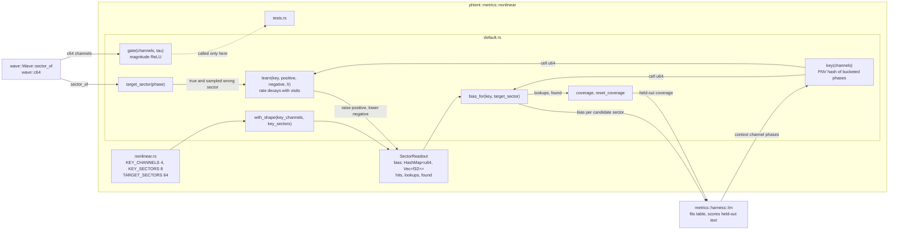

# metrics · nonlinear

```mermaid
graph LR
    WaveIn["wave::Wave::sector_of<br/>wave::c64"]
    Harness["metrics::harness::lm<br/>fits table, scores held-out text"]

    subgraph nonlinear["phient::metrics::nonlinear"]
        Consts["nonlinear.rs<br/>KEY_CHANNELS 4, KEY_SECTORS 8<br/>TARGET_SECTORS 64"]
        Table["SectorReadout<br/>bias: HashMap&lt;u64, Vec&lt;f32&gt;&gt;<br/>hits, lookups, found"]
        subgraph defaultrs["default.rs"]
            Shape["with_shape(key_channels, key_sectors)"]
            Key["key(channels)<br/>FNV hash of bucketed phases"]
            TSec["target_sector(phase)"]
            Learn["learn(key, positive, negative, lr)<br/>rate decays with visits"]
            Bias["bias_for(key, target_sector)"]
            Cov["coverage, reset_coverage"]
            Gate["gate(channels, tau)<br/>magnitude ReLU"]
        end
        Tests["tests.rs"]
    end

    Consts --> Shape
    Shape --> Table
    Harness -->|"context channel phases"| Key
    WaveIn -->|"sector_of"| TSec
    Key -->|"cell u64"| Learn
    TSec -->|"true and sampled wrong sector"| Learn
    Learn -->|"raise positive, lower negative"| Table
    Table --> Bias
    Key -->|"cell u64"| Bias
    Bias -->|"bias per candidate sector"| Harness
    Bias -->|"lookups, found"| Cov
    Cov -->|"held-out coverage"| Harness
    WaveIn -->|"c64 channels"| Gate
    Gate -.->|"called only here"| Tests
```
