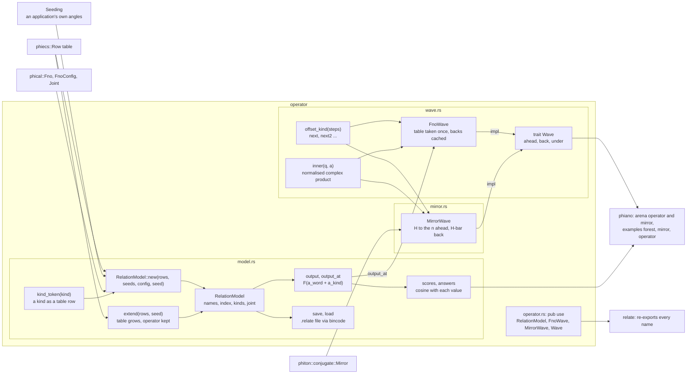

# operator

```mermaid
graph LR
    RowsIn["phiecs::Row table"]
    SeedsIn["Seeding<br/>an application's own angles"]
    PhicalIn["phical::Fno, FnoConfig, Joint"]
    MirrorIn["phiton::conjugate::Mirror"]
    subgraph operatorMod["operator"]
        reexp["operator.rs: pub use<br/>RelationModel, FnoWave, MirrorWave, Wave"]
        subgraph modelRs["model.rs"]
            kindToken["kind_token(kind)<br/>a kind as a table row"]
            newFn["RelationModel::new(rows, seeds, config, seed)"]
            ModelT["RelationModel<br/>names, index, kinds, joint"]
            extendFn["extend(rows, seed)<br/>table grows, operator kept"]
            outputFn["output, output_at<br/>F(a_word + a_kind)"]
            scoresFn["scores, answers<br/>cosine with each value"]
            saveLoad["save, load<br/>.relate file via bincode"]
        end
        subgraph waveRs["wave.rs"]
            WaveT["trait Wave<br/>ahead, back, under"]
            innerFn["inner(q, a)<br/>normalised complex product"]
            offsetKind["offset_kind(steps)<br/>next, next2 ..."]
            FnoWaveT["FnoWave<br/>table taken once, backs cached"]
        end
        subgraph mirrorRs["mirror.rs"]
            MirrorWaveT["MirrorWave<br/>H to the n ahead, H-bar back"]
        end
    end
    RelateRe["relate: re-exports every name"]
    ReadersOut["phiano: arena operator and mirror,<br/>examples forest, mirror, operator"]

    RowsIn --> newFn
    SeedsIn --> newFn
    PhicalIn --> newFn
    kindToken --> newFn
    newFn --> ModelT
    RowsIn --> extendFn
    extendFn --> ModelT
    ModelT --> outputFn
    outputFn --> scoresFn
    ModelT --> saveLoad
    outputFn -->|"output_at"| FnoWaveT
    offsetKind --> FnoWaveT
    offsetKind --> MirrorWaveT
    innerFn --> FnoWaveT
    innerFn --> MirrorWaveT
    MirrorIn --> MirrorWaveT
    FnoWaveT -->|"impl"| WaveT
    MirrorWaveT -->|"impl"| WaveT
    reexp --> RelateRe
    WaveT --> ReadersOut
    scoresFn --> ReadersOut
```
