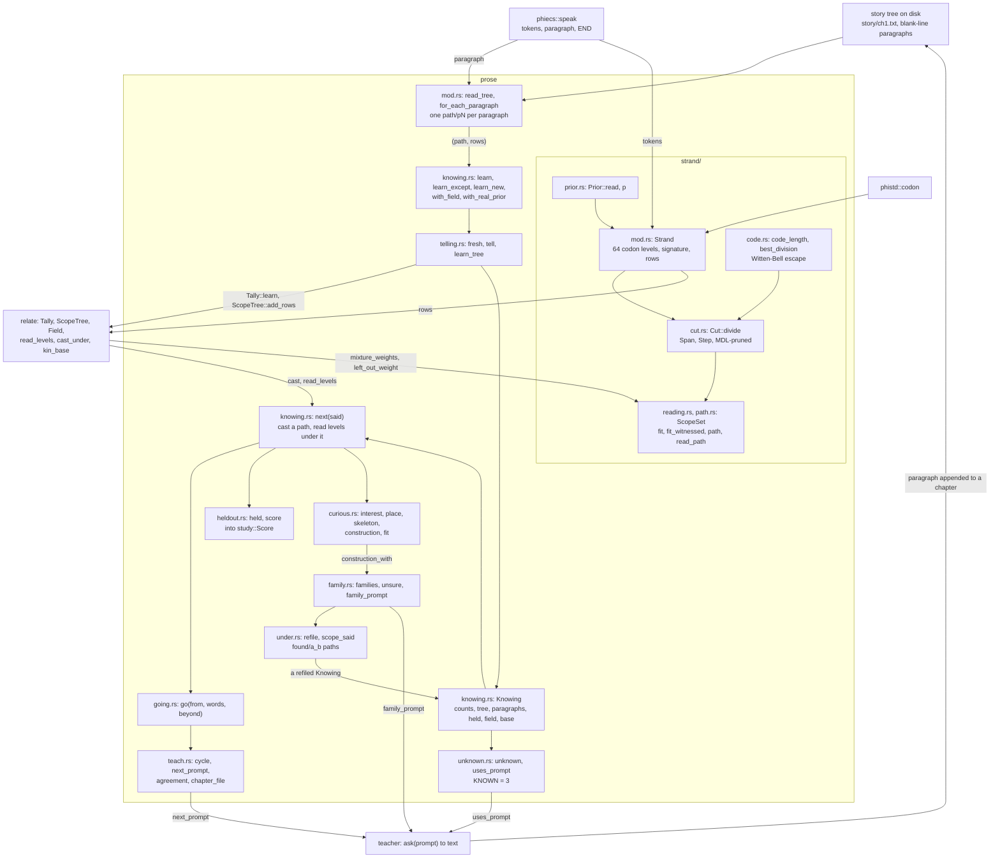

# prose

```mermaid
graph TB
    TxtTree["story tree on disk<br/>story/ch1.txt, blank-line paragraphs"]
    SpeakIn["phiecs::speak<br/>tokens, paragraph, END"]
    subgraph proseMod["prose"]
        modRs["mod.rs: read_tree, for_each_paragraph<br/>one path/pN per paragraph"]
        learnFns["knowing.rs: learn, learn_except, learn_new,<br/>with_field, with_real_prior"]
        telling["telling.rs: fresh, tell, learn_tree"]
        KnowingT["knowing.rs: Knowing<br/>counts, tree, paragraphs, held, field, base"]
        nextFn["knowing.rs: next(said)<br/>cast a path, read levels under it"]
        going["going.rs: go(from, words, beyond)"]
        heldout["heldout.rs: held, score<br/>into study::Score"]
        curious["curious.rs: interest, place, skeleton,<br/>construction, fit"]
        family["family.rs: families, unsure, family_prompt"]
        underRs["under.rs: refile, scope_said<br/>found/a_b paths"]
        unknownRs["unknown.rs: unknown, uses_prompt<br/>KNOWN = 3"]
        teach["teach.rs: cycle, next_prompt,<br/>agreement, chapter_file"]
        subgraph strandDir["strand/"]
            strandMod["mod.rs: Strand<br/>64 codon levels, signature, rows"]
            cutRs["cut.rs: Cut::divide<br/>Span, Step, MDL-pruned"]
            codeRs["code.rs: code_length, best_division<br/>Witten-Bell escape"]
            priorRs["prior.rs: Prior::read, p"]
            readingRs["reading.rs, path.rs: ScopeSet<br/>fit, fit_witnessed, path, read_path"]
        end
    end
    RelateIn["relate: Tally, ScopeTree, Field,<br/>read_levels, cast_under, kin_base"]
    TeacherIn["teacher: ask(prompt) to text"]
    CodonIn["phistd::codon"]

    TxtTree --> modRs
    SpeakIn -->|"paragraph"| modRs
    modRs -->|"(path, rows)"| learnFns
    learnFns --> telling
    telling -->|"Tally::learn, ScopeTree::add_rows"| RelateIn
    telling --> KnowingT
    KnowingT --> nextFn
    RelateIn -->|"cast, read_levels"| nextFn
    nextFn --> going
    nextFn --> heldout
    nextFn --> curious
    curious -->|"construction_with"| family
    family --> underRs
    underRs -->|"a refiled Knowing"| KnowingT
    KnowingT --> unknownRs
    unknownRs -->|"uses_prompt"| TeacherIn
    family -->|"family_prompt"| TeacherIn
    going --> teach
    teach -->|"next_prompt"| TeacherIn
    TeacherIn -->|"paragraph appended to a chapter"| TxtTree
    SpeakIn -->|"tokens"| strandMod
    priorRs --> strandMod
    CodonIn --> strandMod
    strandMod --> cutRs
    codeRs --> cutRs
    cutRs --> readingRs
    RelateIn -->|"mixture_weights, left_out_weight"| readingRs
    strandMod -->|"rows"| RelateIn
```
