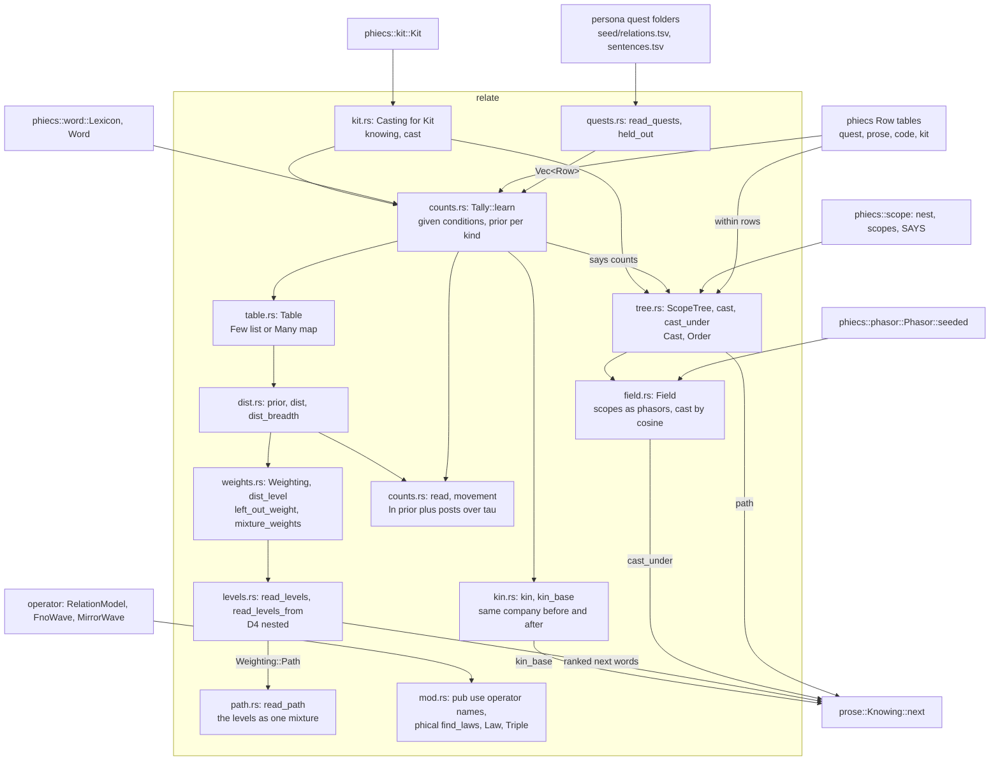

# relate

```mermaid
graph TB
    RowsIn["phiecs Row tables<br/>quest, prose, code, kit"]
    QuestDirs["persona quest folders<br/>seed/relations.tsv, sentences.tsv"]
    LexiconIn["phiecs::word::Lexicon, Word"]
    ScopeIn["phiecs::scope: nest, scopes, SAYS"]
    PhasorIn["phiecs::phasor::Phasor::seeded"]
    KitIn["phiecs::kit::Kit"]
    OperatorIn["operator: RelationModel, FnoWave, MirrorWave"]
    subgraph relateMod["relate"]
        quests["quests.rs: read_quests, held_out"]
        counts["counts.rs: Tally::learn<br/>given conditions, prior per kind"]
        tableRs["table.rs: Table<br/>Few list or Many map"]
        distRs["dist.rs: prior, dist, dist_breadth"]
        weightsRs["weights.rs: Weighting, dist_level<br/>left_out_weight, mixture_weights"]
        readFn["counts.rs: read, movement<br/>ln prior plus posts over tau"]
        levelsRs["levels.rs: read_levels, read_levels_from<br/>D4 nested"]
        pathRs["path.rs: read_path<br/>the levels as one mixture"]
        treeRs["tree.rs: ScopeTree, cast, cast_under<br/>Cast, Order"]
        fieldRs["field.rs: Field<br/>scopes as phasors, cast by cosine"]
        kinRs["kin.rs: kin, kin_base<br/>same company before and after"]
        kitRs["kit.rs: Casting for Kit<br/>knowing, cast"]
        modRs["mod.rs: pub use operator names,<br/>phical find_laws, Law, Triple"]
    end
    KnowingOut["prose::Knowing::next"]

    QuestDirs --> quests
    quests -->|"Vec&lt;Row&gt;"| counts
    RowsIn --> counts
    LexiconIn --> counts
    counts --> tableRs
    tableRs --> distRs
    distRs --> weightsRs
    counts --> readFn
    distRs --> readFn
    weightsRs --> levelsRs
    levelsRs -->|"Weighting::Path"| pathRs
    RowsIn -->|"within rows"| treeRs
    ScopeIn --> treeRs
    counts -->|"says counts"| treeRs
    counts --> kinRs
    PhasorIn --> fieldRs
    treeRs --> fieldRs
    KitIn --> kitRs
    kitRs --> counts
    kitRs --> treeRs
    OperatorIn --> modRs
    treeRs -->|"path"| KnowingOut
    fieldRs -->|"cast_under"| KnowingOut
    levelsRs -->|"ranked next words"| KnowingOut
    kinRs -->|"kin_base"| KnowingOut
```
