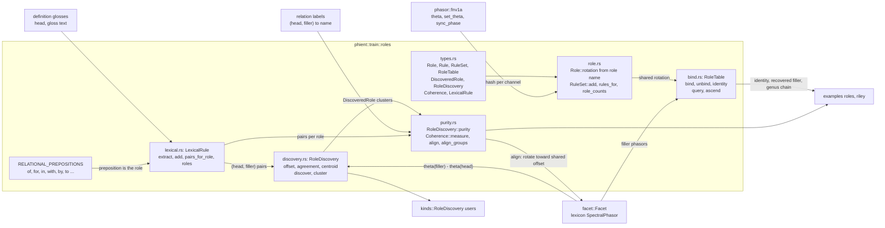

# train · roles

```mermaid
graph LR
    Gloss["definition glosses<br/>head, gloss text"]
    Facet["facet::Facet<br/>lexicon SpectralPhasor"]
    Phasor["phasor::fnv1a<br/>theta, set_theta, sync_phase"]
    Labels["relation labels<br/>(head, filler) to name"]
    Kinds["kinds::RoleDiscovery users"]
    Examples["examples roles, riley"]

    subgraph roles["phient::train::roles"]
        Types["types.rs<br/>Role, Rule, RuleSet, RoleTable<br/>DiscoveredRole, RoleDiscovery<br/>Coherence, LexicalRule"]
        Preps["RELATIONAL_PREPOSITIONS<br/>of, for, in, with, by, to ..."]
        RoleRs["role.rs<br/>Role::rotation from role name<br/>RuleSet::add, rules_for, role_counts"]
        Bind["bind.rs: RoleTable<br/>bind, unbind, identity<br/>query, ascend"]
        Lexical["lexical.rs: LexicalRule<br/>extract, add, pairs_for_role, roles"]
        Disc["discovery.rs: RoleDiscovery<br/>offset, agreement, centroid<br/>discover, cluster"]
        Purity["purity.rs<br/>RoleDiscovery::purity<br/>Coherence::measure, align, align_groups"]
    end

    Gloss --> Lexical
    Preps -->|"preposition is the role"| Lexical
    Types --> RoleRs
    Phasor -->|"hash per channel"| RoleRs
    RoleRs -->|"shared rotation"| Bind
    Facet -->|"filler phasors"| Bind
    Bind -->|"identity, recovered filler, genus chain"| Examples
    Lexical -->|"(head, filler) pairs"| Disc
    Facet -->|"theta(filler) - theta(head)"| Disc
    Disc -->|"DiscoveredRole clusters"| Purity
    Labels --> Purity
    Lexical -->|"pairs per role"| Purity
    Purity -->|"align: rotate toward shared offset"| Facet
    Disc --> Kinds
    Purity --> Examples
```
