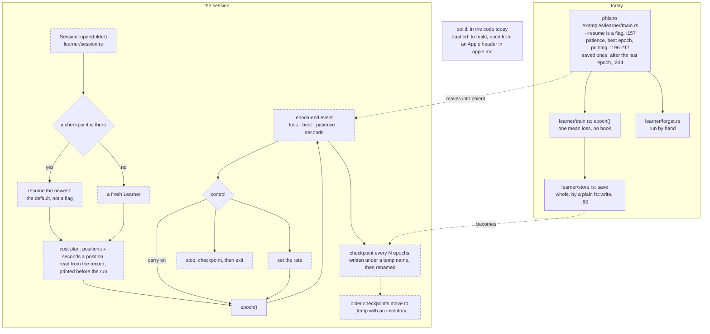
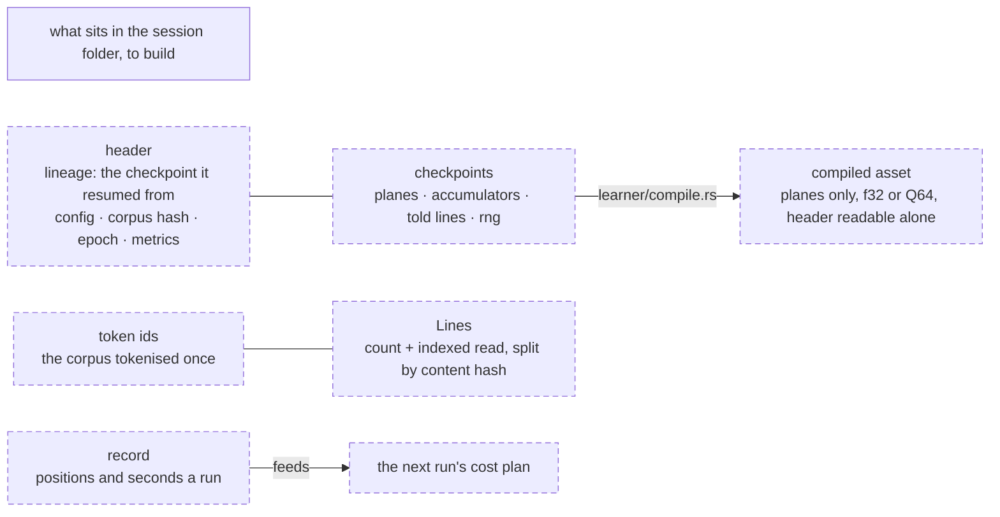
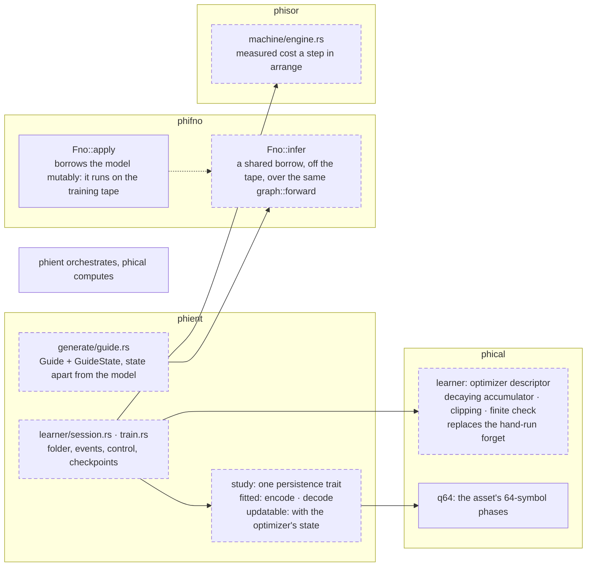
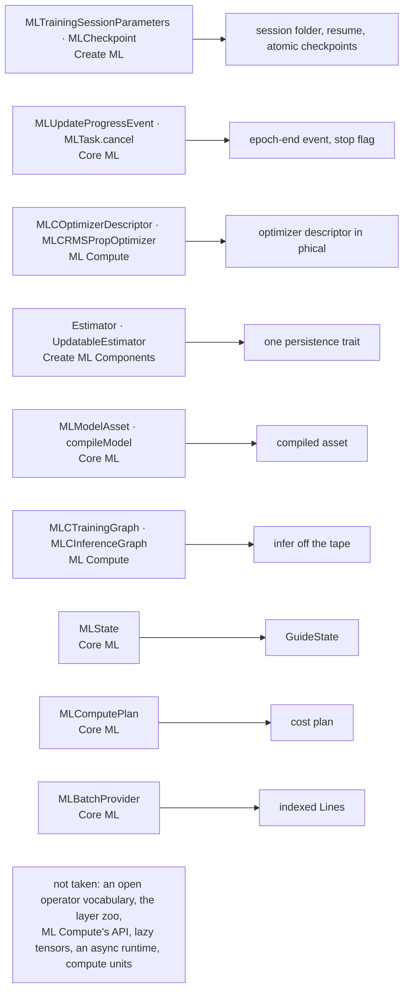

# session

```mermaid
graph TB
    key["solid: in the code today<br/>dashed: to build, each from an Apple header in apple.md"]
    subgraph now["today"]
        n_main["phiano examples/learner/main.rs<br/>--resume is a flag, :157<br/>patience, best epoch, printing, :196-217<br/>saved once, after the last epoch, :234"]
        n_epoch["learner/train.rs: epoch()<br/>one mean loss, no hook"]
        n_store["learner/store.rs: save<br/>whole, by a plain fs::write, :60"]
        n_forget["learner/forget.rs<br/>run by hand"]
        n_main --> n_epoch --> n_store
        n_main --> n_forget
    end
    subgraph next["the session"]
        s_open["Session::open(folder)<br/>learner/session.rs"]
        s_new{"a checkpoint is there"}
        s_resume["resume the newest:<br/>the default, not a flag"]
        s_fresh["a fresh Learner"]
        s_plan["cost plan: positions x seconds a position,<br/>read from the record, printed before the run"]
        s_epoch["epoch()"]
        s_event["epoch-end event<br/>loss · best · patience · seconds"]
        s_ctl{"control"}
        s_rate["set the rate"]
        s_stop["stop: checkpoint, then exit"]
        s_ckpt["checkpoint every N epochs:<br/>written under a temp name, then renamed"]
        s_old["older checkpoints move to _temp with an inventory"]
        s_open --> s_new
        s_new -->|yes| s_resume
        s_new -->|no| s_fresh
        s_resume --> s_plan
        s_fresh --> s_plan
        s_plan --> s_epoch --> s_event --> s_ctl
        s_ctl -->|carry on| s_epoch
        s_ctl --> s_rate --> s_epoch
        s_ctl --> s_stop
        s_event --> s_ckpt --> s_old
    end
    n_main -.->|"moves into phient"| s_event
    n_store -.->|"becomes"| s_ckpt
    classDef plan stroke-dasharray: 6 4;
    class s_open,s_new,s_resume,s_fresh,s_plan,s_event,s_ctl,s_rate,s_stop,s_ckpt,s_old plan;
```

```mermaid
graph LR
    key["what sits in the session folder, to build"]
    f_head["header<br/>lineage: the checkpoint it resumed from<br/>config · corpus hash · epoch · metrics"]
    f_ckpt["checkpoints<br/>planes · accumulators · told lines · rng"]
    f_ids["token ids<br/>the corpus tokenised once"]
    f_lines["Lines<br/>count + indexed read, split by content hash"]
    f_asset["compiled asset<br/>planes only, f32 or Q64, header readable alone"]
    f_rec["record<br/>positions and seconds a run"]
    f_head --- f_ckpt
    f_ids --- f_lines
    f_ckpt -->|"learner/compile.rs"| f_asset
    f_rec -->|"feeds"| f_plan["the next run's cost plan"]
    classDef plan stroke-dasharray: 6 4;
    class f_head,f_ckpt,f_ids,f_lines,f_asset,f_rec,f_plan plan;
```

```mermaid
graph LR
    key["phient orchestrates, phical computes"]
    subgraph phient["phient"]
        o_sess["learner/session.rs · train.rs<br/>folder, events, control, checkpoints"]
        o_trait["study: one persistence trait<br/>fitted: encode · decode<br/>updatable: with the optimizer's state"]
        o_guide["generate/guide.rs<br/>Guide + GuideState, state apart from the model"]
    end
    subgraph phical["phical"]
        c_opt["learner: optimizer descriptor<br/>decaying accumulator · clipping · finite check<br/>replaces the hand-run forget"]
        c_q64["q64: the asset's 64-symbol phases"]
    end
    subgraph phifno["phifno"]
        i_train["Fno::apply<br/>borrows the model mutably: it runs on the training tape"]
        i_infer["Fno::infer<br/>a shared borrow, off the tape, over the same graph::forward"]
    end
    subgraph phisor["phisor"]
        m_cost["machine/engine.rs<br/>measured cost a step in arrange"]
    end
    o_sess --> c_opt
    o_sess --> o_trait
    o_trait --> c_q64
    o_guide --> i_infer
    i_train -.-> i_infer
    o_sess --> m_cost
    classDef plan stroke-dasharray: 6 4;
    class o_sess,o_trait,o_guide,c_opt,i_infer,m_cost plan;
```

```mermaid
graph LR
    a1["MLTrainingSessionParameters · MLCheckpoint<br/>Create ML"] --> p1["session folder, resume, atomic checkpoints"]
    a2["MLUpdateProgressEvent · MLTask.cancel<br/>Core ML"] --> p2["epoch-end event, stop flag"]
    a3["MLCOptimizerDescriptor · MLCRMSPropOptimizer<br/>ML Compute"] --> p3["optimizer descriptor in phical"]
    a4["Estimator · UpdatableEstimator<br/>Create ML Components"] --> p4["one persistence trait"]
    a5["MLModelAsset · compileModel<br/>Core ML"] --> p5["compiled asset"]
    a6["MLCTrainingGraph · MLCInferenceGraph<br/>ML Compute"] --> p6["infer off the tape"]
    a7["MLState<br/>Core ML"] --> p7["GuideState"]
    a8["MLComputePlan<br/>Core ML"] --> p8["cost plan"]
    a9["MLBatchProvider<br/>Core ML"] --> p9["indexed Lines"]
    no["not taken: an open operator vocabulary, the layer zoo,<br/>ML Compute's API, lazy tensors, an async runtime, compute units"]
```
