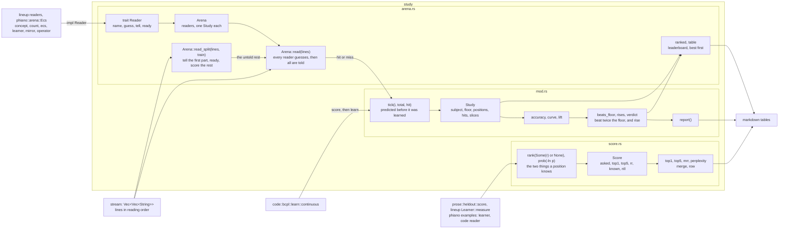

# study

```mermaid
graph LR
    LinesIn["stream: Vec&lt;Vec&lt;String&gt;&gt;<br/>lines in reading order"]
    PhianoReaders["lineup readers, phiano::arena::Ecs<br/>concept, count, ecs, learner, mirror, operator"]
    Measurers["prose::heldout::score, lineup Learner::measure<br/>phiano examples: learner, code reader"]
    BcplLearn["code::bcpl::learn::continuous"]
    subgraph studyMod["study"]
        subgraph arenaRs["arena.rs"]
            ReaderT["trait Reader<br/>name, guess, tell, ready"]
            ArenaT["Arena<br/>readers, one Study each"]
            readFn["Arena::read(lines)<br/>every reader guesses, then all are told"]
            splitFn["Arena::read_split(lines, train)<br/>tell the first part, ready, score the rest"]
            tableFn["ranked, table<br/>leaderboard, best first"]
        end
        subgraph scoreRs["score.rs"]
            ScoreT["Score<br/>asked, top1, top5, rr, known, nll"]
            rankFn["rank(Some(r) or None), prob(-ln p)<br/>the two things a position knows"]
            derivedFn["top1, top5, mrr, perplexity<br/>merge, row"]
        end
        subgraph modRs["mod.rs"]
            StudyT["Study<br/>subject, floor, positions, hits, slices"]
            tickFn["tick(i, total, hit)<br/>predicted before it was learned"]
            curveFn["accuracy, curve, lift"]
            verdictFn["beats_floor, rises, verdict<br/>beat twice the floor, and rise"]
            reportFn["report()"]
        end
    end
    ReportOut["markdown tables"]

    PhianoReaders -->|"impl Reader"| ReaderT
    ReaderT --> ArenaT
    ArenaT --> readFn
    LinesIn --> readFn
    LinesIn --> splitFn
    splitFn -->|"the untold rest"| readFn
    readFn -->|"hit or miss"| tickFn
    BcplLearn -->|"score, then learn"| tickFn
    tickFn --> StudyT
    StudyT --> curveFn
    curveFn --> verdictFn
    verdictFn --> reportFn
    StudyT --> tableFn
    verdictFn --> tableFn
    reportFn --> ReportOut
    Measurers --> rankFn
    rankFn --> ScoreT
    ScoreT --> derivedFn
    derivedFn --> ReportOut
    tableFn --> ReportOut
```
