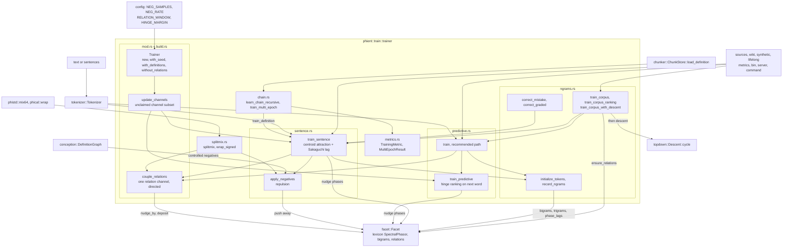

# train · trainer

```mermaid
graph TB
    Text["text or sentences"]
    Callers["sources, wiki, synthetic, lifelong<br/>metrics, bin, server, command"]
    Tok["tokenizer::Tokenizer"]
    Config["config: NEG_SAMPLES, NEG_RATE<br/>RELATION_WINDOW, HINGE_MARGIN"]
    DefGraph["conception::DefinitionGraph"]
    Chunk["chunker::ChunkStore::load_definition"]
    Ext["phistd::mix64, phical::wrap"]

    subgraph trainer["phient::train::trainer"]
        subgraph buildrs["mod.rs + build.rs"]
            TrainerT["Trainer<br/>new, with_seed, with_definitions, without_relations"]
            UpdCh["update_channels<br/>unclaimed channel subset"]
            Couple["couple_relations<br/>one relation channel, directed"]
        end
        subgraph ngramsrs["ngrams.rs"]
            Corpus["train_corpus, train_corpus_ranking<br/>train_corpus_with_descent"]
            Record["initialize_tokens, record_ngrams"]
            Correct["correct_mistake, correct_graded"]
        end
        subgraph sentencers["sentence.rs"]
            TrainSent["train_sentence<br/>centroid attraction + Sakaguchi lag"]
            Neg["apply_negatives<br/>repulsion"]
        end
        subgraph predictivers["predictive.rs"]
            Train["train, recommended path"]
            Pred["train_predictive<br/>hinge ranking on next word"]
        end
        Chain["chain.rs<br/>learn_chain_recursive, train_multi_epoch"]
        Split["splitmix.rs<br/>splitmix, wrap_signed"]
        Metrics["metrics.rs<br/>TrainingMetric, MultiEpochResult"]
    end

    Facet["facet::Facet<br/>lexicon SpectralPhasor, bigrams, relations"]
    Topdown["topdown::Descent::cycle"]

    Callers --> Corpus
    Callers --> TrainSent
    Callers --> Train
    Text --> Tok
    Tok --> TrainSent
    Tok --> Train
    Config --> TrainerT
    TrainerT --> UpdCh
    Corpus -->|"ensure_relations"| Facet
    Corpus --> TrainSent
    Corpus --> Train
    Corpus -->|"then descent"| Topdown
    TrainSent --> Record
    Train --> Record
    Train --> Pred
    UpdCh --> TrainSent
    UpdCh --> Pred
    TrainSent --> Neg
    TrainSent --> Couple
    Train --> Couple
    DefGraph -->|"controlled negatives"| Neg
    Ext --> Split
    Split --> Neg
    Split --> Couple
    Record -->|"bigrams, trigrams, phase_lags"| Facet
    TrainSent -->|"nudge phases"| Facet
    Pred -->|"nudge phases"| Facet
    Neg -->|"push away"| Facet
    Couple -->|"nudge_by, deposit"| Facet
    Correct --> TrainSent
    Chunk --> Chain
    Chain -->|"train_definition"| TrainSent
    Chain --> Metrics
```
