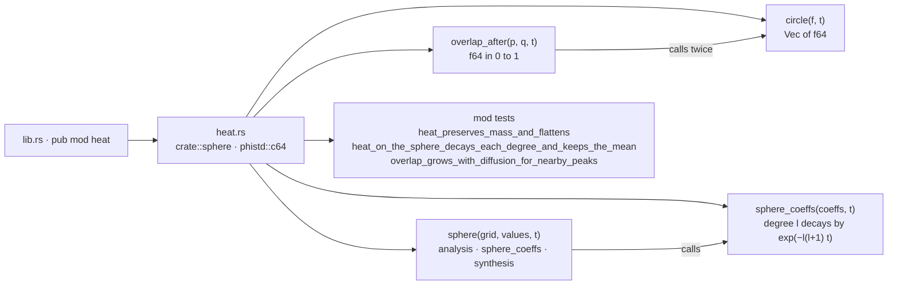
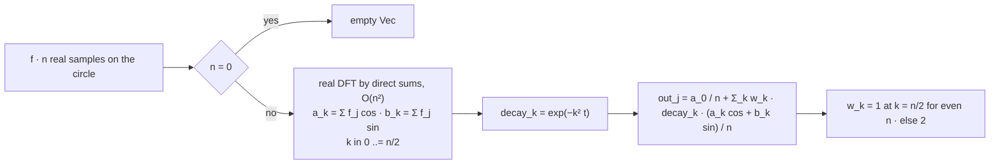
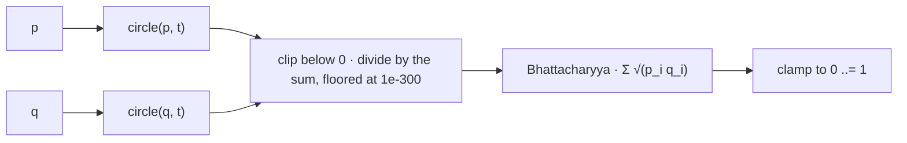
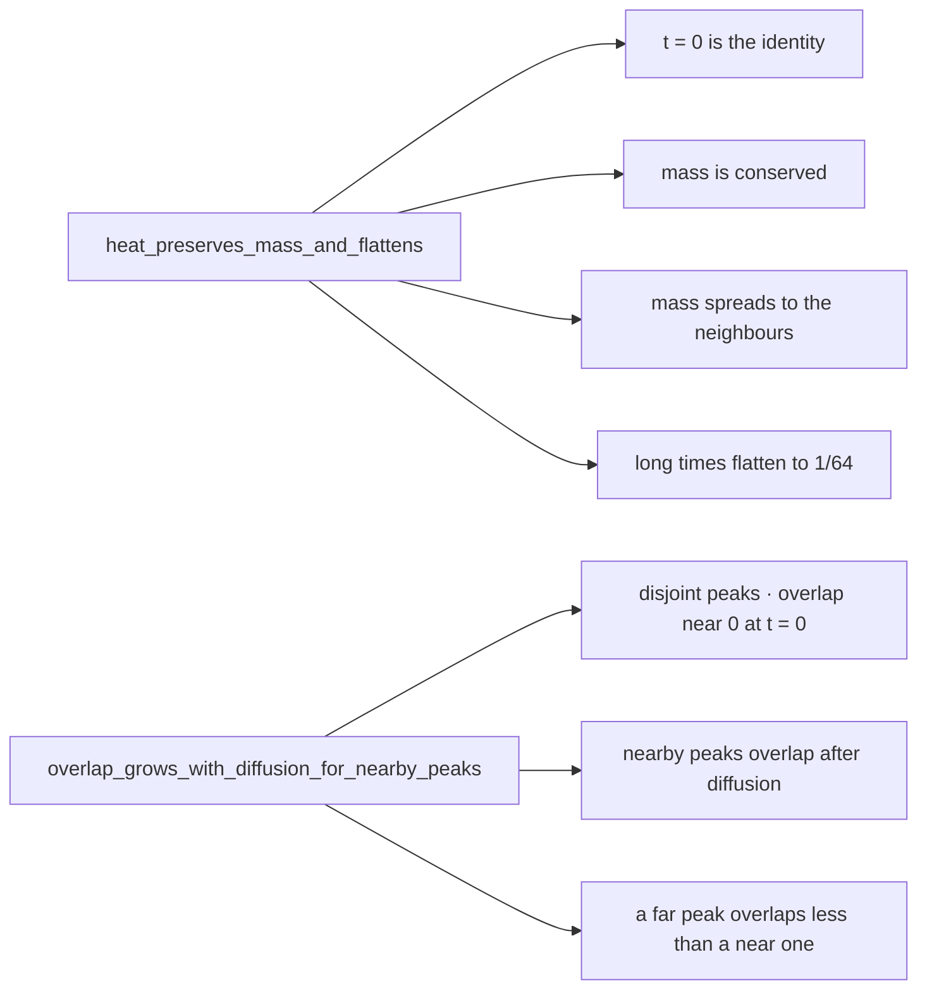

# heat

## Inside heat.rs

```mermaid
graph LR
    LIB["lib.rs · pub mod heat"] --> H["heat.rs<br/>crate::sphere · phistd::c64"]
    H --> C["circle(f, t)<br/>Vec of f64"]
    H --> SC["sphere_coeffs(coeffs, t)<br/>degree l decays by exp(−l(l+1) t)"]
    H --> SG["sphere(grid, values, t)<br/>analysis · sphere_coeffs · synthesis"]
    SG -->|"calls"| SC
    H --> O["overlap_after(p, q, t)<br/>f64 in 0 to 1"]
    O -->|"calls twice"| C
    H --> T["mod tests<br/>heat_preserves_mass_and_flattens<br/>heat_on_the_sphere_decays_each_degree_and_keeps_the_mean<br/>overlap_grows_with_diffusion_for_nearby_peaks"]
```

## circle(f, t) — mode k decays by exp(−k² t)

```mermaid
flowchart LR
    F["f · n real samples on the circle"] --> E{"n = 0"}
    E -->|"yes"| EMPTY["empty Vec"]
    E -->|"no"| DFT["real DFT by direct sums, O(n²)<br/>a_k = Σ f_j cos · b_k = Σ f_j sin<br/>k in 0 ..= n/2"]
    DFT --> D["decay_k = exp(−k² t)"]
    D --> S["out_j = a_0 / n + Σ_k w_k · decay_k · (a_k cos + b_k sin) / n"]
    S --> W["w_k = 1 at k = n/2 for even n · else 2"]
```

## overlap_after(p, q, t) — nearby by overlap after diffusion

```mermaid
flowchart LR
    P["p"] --> CP["circle(p, t)"]
    Q["q"] --> CQ["circle(q, t)"]
    CP & CQ --> N["clip below 0 · divide by the sum, floored at 1e-300"]
    N --> B["Bhattacharyya · Σ √(p_i q_i)"]
    B --> CL["clamp to 0 ..= 1"]
```

## What the tests pin

```mermaid
flowchart LR
    T1["heat_preserves_mass_and_flattens"] --> A["t = 0 is the identity"]
    T1 --> B["mass is conserved"]
    T1 --> C["mass spreads to the neighbours"]
    T1 --> D["long times flatten to 1/64"]
    T2["overlap_grows_with_diffusion_for_nearby_peaks"] --> E["disjoint peaks · overlap near 0 at t = 0"]
    T2 --> F["nearby peaks overlap after diffusion"]
    T2 --> G["a far peak overlaps less than a near one"]
```
