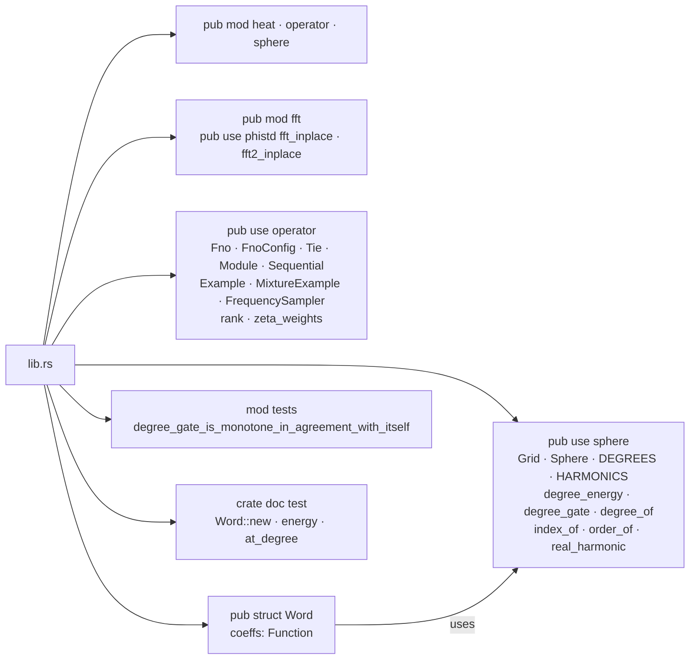
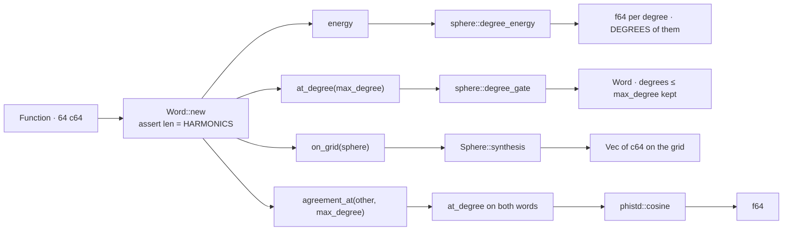
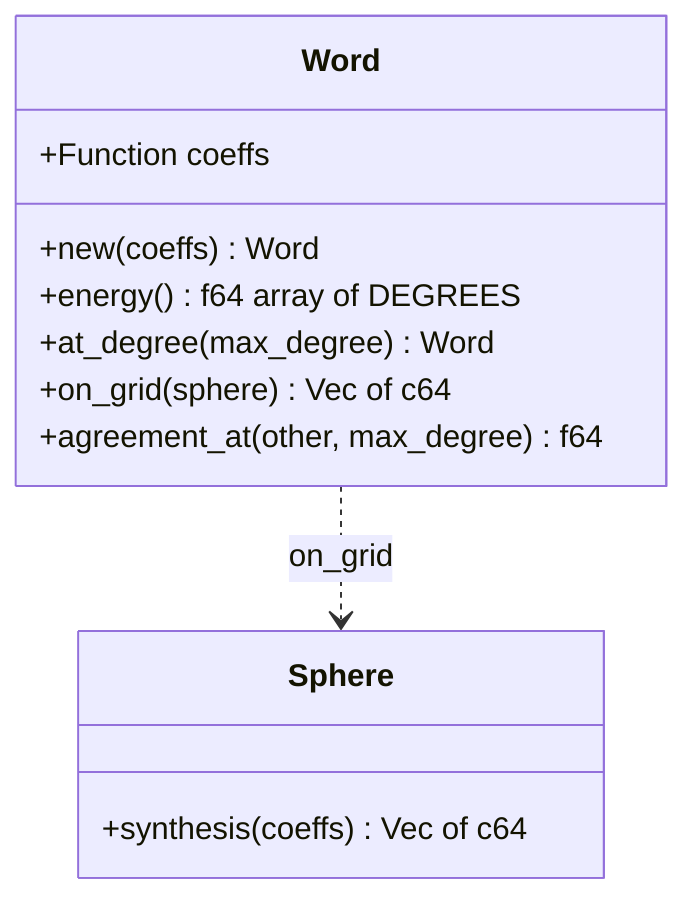
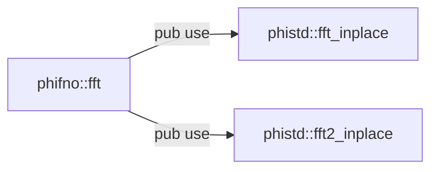

# lib

## Inside lib.rs

```mermaid
graph LR
    lib["lib.rs"]
    mods["pub mod heat · operator · sphere"]
    fft["pub mod fft<br/>pub use phistd fft_inplace · fft2_inplace"]
    reop["pub use operator<br/>Fno · FnoConfig · Tie · Module · Sequential<br/>Example · MixtureExample · FrequencySampler<br/>rank · zeta_weights"]
    resp["pub use sphere<br/>Grid · Sphere · DEGREES · HARMONICS<br/>degree_energy · degree_gate · degree_of<br/>index_of · order_of · real_harmonic"]
    word["pub struct Word<br/>coeffs: Function"]
    tests["mod tests<br/>degree_gate_is_monotone_in_agreement_with_itself"]
    doc["crate doc test<br/>Word::new · energy · at_degree"]
    lib --> mods & fft & reop & resp & word & tests & doc
    word -->|"uses"| resp
```

## Word — one function, four readings

```mermaid
flowchart LR
    C["Function · 64 c64"] --> N["Word::new<br/>assert len = HARMONICS"]
    N --> E["energy"] --> DE["sphere::degree_energy"] --> EA["f64 per degree · DEGREES of them"]
    N --> AD["at_degree(max_degree)"] --> DG["sphere::degree_gate"] --> W2["Word · degrees ≤ max_degree kept"]
    N --> OG["on_grid(sphere)"] --> SY["Sphere::synthesis"] --> V["Vec of c64 on the grid"]
    N --> AG["agreement_at(other, max_degree)"] --> AD2["at_degree on both words"] --> COS["phistd::cosine"] --> F["f64"]
```

## Word — the type

```mermaid
classDiagram
    class Word {
        +Function coeffs
        +new(coeffs) Word
        +energy() f64 array of DEGREES
        +at_degree(max_degree) Word
        +on_grid(sphere) Vec of c64
        +agreement_at(other, max_degree) f64
    }
    class Sphere {
        +synthesis(coeffs) Vec of c64
    }
    Word ..> Sphere : on_grid
```

## fft — one address, home of record in phistd

```mermaid
graph LR
    U["phifno::fft"] -->|"pub use"| A["phistd::fft_inplace"]
    U -->|"pub use"| B["phistd::fft2_inplace"]
```
