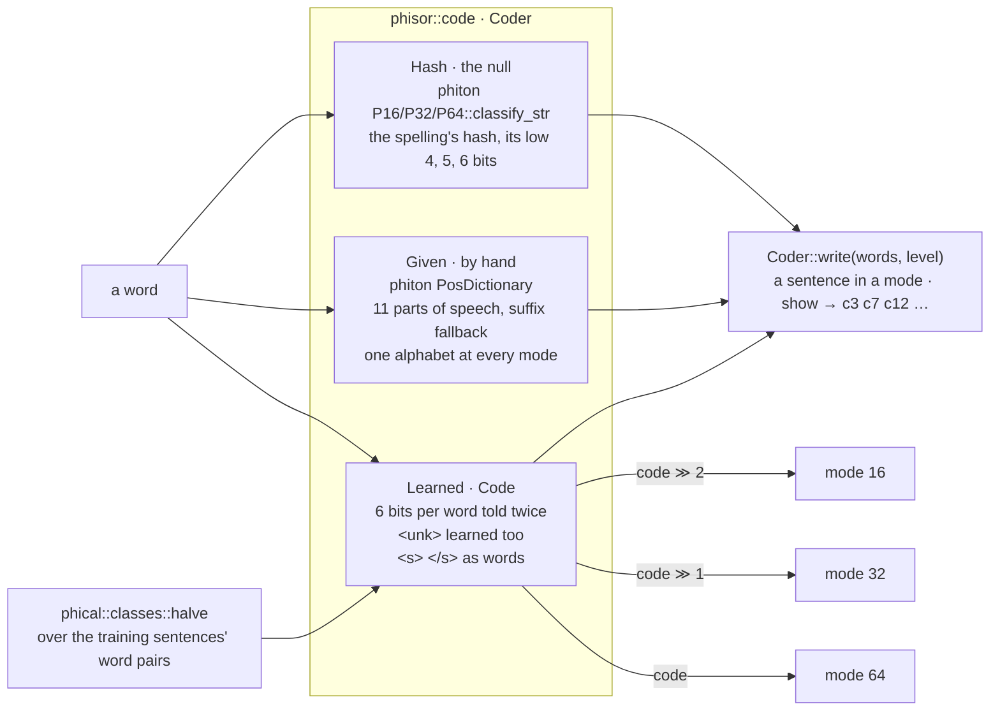

# code

```mermaid
graph LR
    w["a word"]
    subgraph code_["phisor::code · Coder"]
        hash["Hash · the null<br/>phiton P16/P32/P64::classify_str<br/>the spelling's hash, its low 4, 5, 6 bits"]
        given["Given · by hand<br/>phiton PosDictionary<br/>11 parts of speech, suffix fallback<br/>one alphabet at every mode"]
        learned["Learned · Code<br/>6 bits per word told twice<br/>&lt;unk&gt; learned too<br/>&lt;s&gt; &lt;/s&gt; as words"]
    end
    w --> hash
    w --> given
    w --> learned
    learned -->|"code ≫ 2"| m16["mode 16"]
    learned -->|"code ≫ 1"| m32["mode 32"]
    learned -->|"code"| m64["mode 64"]
    ex["phical::classes::halve<br/>over the training sentences' word pairs"] --> learned
    write["Coder::write(words, level)<br/>a sentence in a mode · show → c3 c7 c12 …"]
    hash --> write
    given --> write
    learned --> write
```
