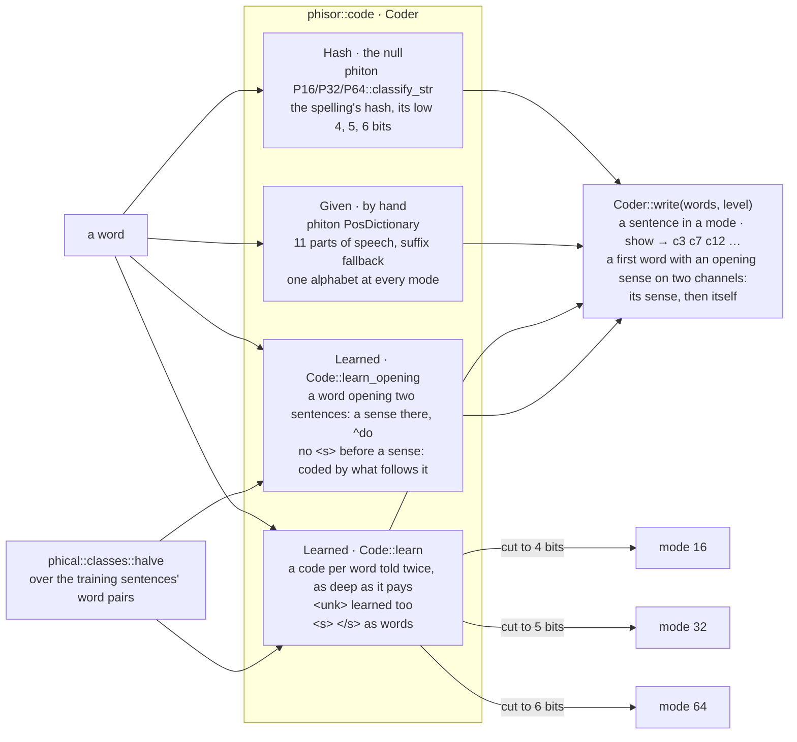
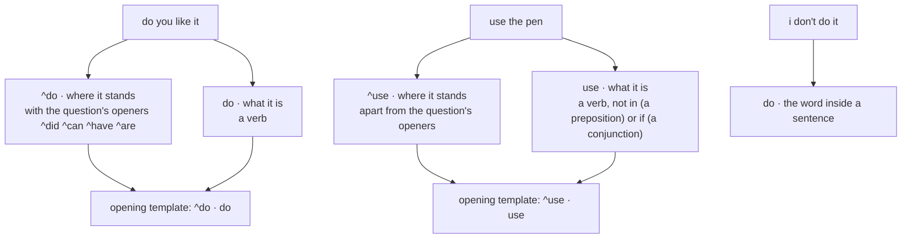

# code

```mermaid
graph LR
    w["a word"]
    subgraph code_["phisor::code · Coder"]
        hash["Hash · the null<br/>phiton P16/P32/P64::classify_str<br/>the spelling's hash, its low 4, 5, 6 bits"]
        given["Given · by hand<br/>phiton PosDictionary<br/>11 parts of speech, suffix fallback<br/>one alphabet at every mode"]
        learned["Learned · Code::learn<br/>a code per word told twice, as deep as it pays<br/>&lt;unk&gt; learned too<br/>&lt;s&gt; &lt;/s&gt; as words"]
        opening["Learned · Code::learn_opening<br/>a word opening two sentences: a sense there, ^do<br/>no &lt;s&gt; before a sense: coded by what follows it"]
    end
    w --> hash
    w --> given
    w --> learned
    w --> opening
    learned -->|"cut to 4 bits"| m16["mode 16"]
    learned -->|"cut to 5 bits"| m32["mode 32"]
    learned -->|"cut to 6 bits"| m64["mode 64"]
    ex["phical::classes::halve<br/>over the training sentences' word pairs"] --> learned
    ex --> opening
    write["Coder::write(words, level)<br/>a sentence in a mode · show → c3 c7 c12 …<br/>a first word with an opening sense on two channels:<br/>its sense, then itself"]
    hash --> write
    given --> write
    learned --> write
    opening --> write
```

```mermaid
graph TB
    s1["do you like it"]
    s2["use the pen"]
    s3["i don't do it"]
    o1["^do · where it stands<br/>with the question's openers ^did ^can ^have ^are"]
    w1["do · what it is<br/>a verb"]
    o2["^use · where it stands<br/>apart from the question's openers"]
    w2["use · what it is<br/>a verb, not in (a preposition) or if (a conjunction)"]
    d["do · the word inside a sentence"]
    t1["opening template: ^do · do"]
    t2["opening template: ^use · use"]
    s1 --> o1 --> t1
    s1 --> w1 --> t1
    s2 --> o2 --> t2
    s2 --> w2 --> t2
    s3 --> d
```
