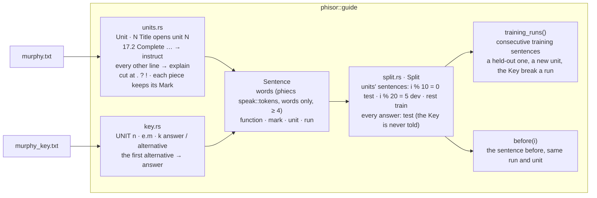
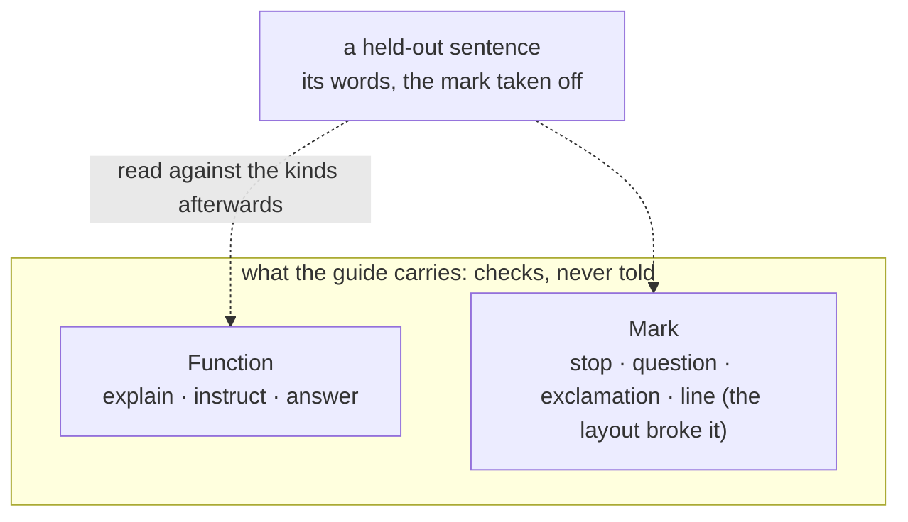

# guide

```mermaid
graph LR
    text["murphy.txt"]
    keyt["murphy_key.txt"]
    subgraph guide_["phisor::guide"]
        units["units.rs<br/>Unit · N Title opens unit N<br/>17.2 Complete … → instruct<br/>every other line → explain<br/>cut at . ? ! · each piece keeps its Mark"]
        key["key.rs<br/>UNIT n · e.m · k answer / alternative<br/>the first alternative → answer"]
        sent["Sentence<br/>words (phiecs speak::tokens, words only, ≥ 4)<br/>function · mark · unit · run"]
        split["split.rs · Split<br/>units' sentences: i % 10 = 0 test · i % 20 = 5 dev · rest train<br/>every answer: test (the Key is never told)"]
        runs["training_runs()<br/>consecutive training sentences<br/>a held-out one, a new unit, the Key break a run"]
        before["before(i)<br/>the sentence before, same run and unit"]
    end
    text --> units --> sent
    keyt --> key --> sent
    sent --> split
    split --> runs
    split --> before
```

```mermaid
graph TB
    subgraph labels["what the guide carries: checks, never told"]
        f["Function<br/>explain · instruct · answer"]
        m["Mark<br/>stop · question · exclamation · line (the layout broke it)"]
    end
    s["a held-out sentence<br/>its words, the mark taken off"]
    s -.->|"read against the kinds afterwards"| f
    s -.-> m
```
