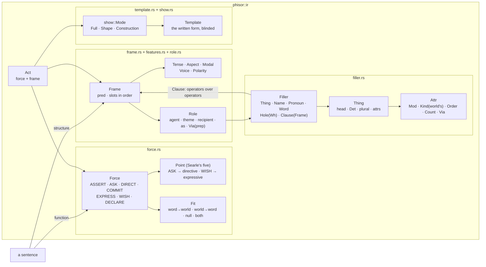
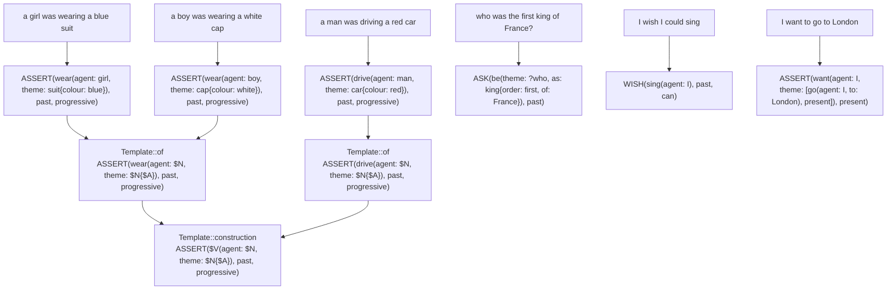

# ir

```mermaid
graph LR
    Sent["a sentence"]
    subgraph ir["phisor::ir"]
        Act["Act<br/>force + frame"]
        subgraph force_["force.rs"]
            Force["Force<br/>ASSERT · ASK · DIRECT · COMMIT<br/>EXPRESS · WISH · DECLARE"]
            Point["Point (Searle's five)<br/>ASK → directive · WISH → expressive"]
            Fit["Fit<br/>word→world · world→word · null · both"]
        end
        subgraph frame_["frame.rs + features.rs + role.rs"]
            Frame["Frame<br/>pred · slots in order"]
            Feat["Tense · Aspect · Modal<br/>Voice · Polarity"]
            Role["Role<br/>agent · theme · recipient · as · Via(prep)"]
        end
        subgraph filler_["filler.rs"]
            Filler["Filler<br/>Thing · Name · Pronoun · Word<br/>Hole(Wh) · Clause(Frame)"]
            Thing["Thing<br/>head · Det · plural · attrs"]
            Attr["Attr<br/>Mod · Kind(world's) · Order · Count · Via"]
        end
        subgraph shape_["template.rs + show.rs"]
            Show["show::Mode<br/>Full · Shape · Construction"]
            Tmpl["Template<br/>the written form, blinded"]
        end
    end
    Sent -->|"function"| Force
    Sent -->|"structure"| Frame
    Act --> Force
    Act --> Frame
    Force --> Point
    Force --> Fit
    Frame --> Feat
    Frame --> Role
    Role --> Filler
    Filler --> Thing
    Thing --> Attr
    Filler -->|"Clause: operators over operators"| Frame
    Act --> Show --> Tmpl
```

```mermaid
graph TB
    g["a girl was wearing a blue suit"] --> ga["ASSERT(wear(agent: girl, theme: suit{colour: blue}), past, progressive)"]
    b["a boy was wearing a white cap"] --> ba["ASSERT(wear(agent: boy, theme: cap{colour: white}), past, progressive)"]
    m["a man was driving a red car"] --> ma["ASSERT(drive(agent: man, theme: car{colour: red}), past, progressive)"]
    ga --> t1["Template::of<br/>ASSERT(wear(agent: $N, theme: $N{$A}), past, progressive)"]
    ba --> t1
    ma --> t2["Template::of<br/>ASSERT(drive(agent: $N, theme: $N{$A}), past, progressive)"]
    t1 --> c["Template::construction<br/>ASSERT($V(agent: $N, theme: $N{$A}), past, progressive)"]
    t2 --> c
    k["who was the first king of France?"] --> ka["ASK(be(theme: ?who, as: king{order: first, of: France}), past)"]
    w["I wish I could sing"] --> wa["WISH(sing(agent: I), past, can)"]
    l["I want to go to London"] --> la["ASSERT(want(agent: I,<br/>theme: [go(agent: I, to: London), present]), present)"]
```
