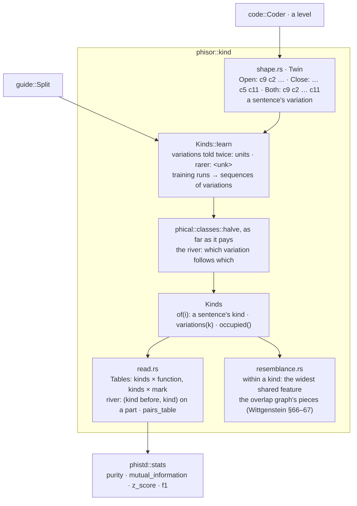
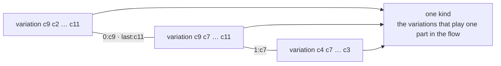

# kind

```mermaid
graph TB
    split["guide::Split"]
    coder["code::Coder · a level"]
    subgraph kind_["phisor::kind"]
        shape["shape.rs · Twin<br/>Open: c9 c2 … · Close: … c5 c11 · Both: c9 c2 … c11<br/>a sentence's variation"]
        learn["Kinds::learn<br/>variations told twice: units · rarer: &lt;unk&gt;<br/>training runs → sequences of variations"]
        halve["phical::classes::halve, as far as it pays<br/>the river: which variation follows which"]
        kinds["Kinds<br/>of(i): a sentence's kind · variations(k) · occupied()"]
        read["read.rs<br/>Tables: kinds × function, kinds × mark<br/>river: (kind before, kind) on a part · pairs_table"]
        res["resemblance.rs<br/>within a kind: the widest shared feature<br/>the overlap graph's pieces (Wittgenstein §66–67)"]
    end
    stats["phistd::stats<br/>purity · mutual_information · z_score · f1"]
    split --> learn
    coder --> shape --> learn --> halve --> kinds
    kinds --> read --> stats
    kinds --> res
```

```mermaid
graph LR
    v1["variation c9 c2 … c11"]
    v2["variation c9 c7 … c11"]
    v3["variation c4 c7 … c3"]
    k["one kind<br/>the variations that play one part in the flow"]
    v1 --> k
    v2 --> k
    v3 --> k
    v1 ---|"0:c9 · last:c11"| v2
    v2 ---|"1:c7"| v3
```
