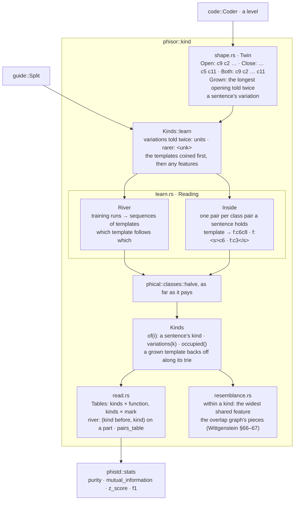
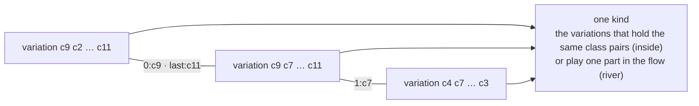

# kind

```mermaid
graph TB
    split["guide::Split"]
    coder["code::Coder · a level"]
    subgraph kind_["phisor::kind"]
        shape["shape.rs · Twin<br/>Open: c9 c2 … · Close: … c5 c11 · Both: c9 c2 … c11<br/>Grown: the longest opening told twice<br/>a sentence's variation"]
        learn["Kinds::learn<br/>variations told twice: units · rarer: &lt;unk&gt;<br/>the templates coined first, then any features"]
        subgraph reading_["learn.rs · Reading"]
            river["River<br/>training runs → sequences of templates<br/>which template follows which"]
            inside["Inside<br/>one pair per class pair a sentence holds<br/>template → f:c6c8 · f:&lt;s&gt;c6 · f:c3&lt;/s&gt;"]
        end
        halve["phical::classes::halve, as far as it pays"]
        kinds["Kinds<br/>of(i): a sentence's kind · variations(k) · occupied()<br/>a grown template backs off along its trie"]
        read["read.rs<br/>Tables: kinds × function, kinds × mark<br/>river: (kind before, kind) on a part · pairs_table"]
        res["resemblance.rs<br/>within a kind: the widest shared feature<br/>the overlap graph's pieces (Wittgenstein §66–67)"]
    end
    stats["phistd::stats<br/>purity · mutual_information · z_score · f1"]
    split --> learn
    coder --> shape --> learn
    learn --> river --> halve
    learn --> inside --> halve
    halve --> kinds
    kinds --> read --> stats
    kinds --> res
```

```mermaid
graph LR
    v1["variation c9 c2 … c11"]
    v2["variation c9 c7 … c11"]
    v3["variation c4 c7 … c3"]
    k["one kind<br/>the variations that hold the same class pairs (inside)<br/>or play one part in the flow (river)"]
    v1 --> k
    v2 --> k
    v3 --> k
    v1 ---|"0:c9 · last:c11"| v2
    v2 ---|"1:c7"| v3
```
